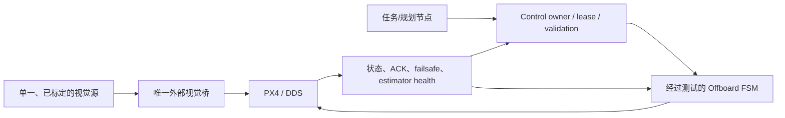

# 架构总览

> 基于 2026-07-23 当前源码静态审查，并纳入 P0-01 的 DDS-only 维护决策。图中虚线表示源码存在但尚未被项目 bringup 编排。

## 1. 当前总体结构

```mermaid
flowchart LR
    T265[RealSense T265 / TF]
    D435[RealSense D435]
    RPL[RPLIDAR]
    CMD[/cmd_vel]
    MCU[外部 MCU/执行器<br/>型号未确认]
    PX4[外部 PX4 飞控<br/>固件/板型未确认]

    T265 -.-> VD[vision_to_dds]
    VD -.->|/fmu/in/vehicle_visual_odometry| AGENT[Micro XRCE-DDS Agent<br/>项目无 transport launch]
    AGENT <.-> PX4

    PLANNER[offboard_demo / animal_testing<br/>或其他发布者]
    PLANNER -->|offboard/cmd<br/>offboard/cmd_mode<br/>offboard/takeoff_land| CTRL[offboard_node / CtrlFSM]
    CTRL -.->|fmu/in/trajectory_setpoint<br/>fmu/in/offboard_control_mode<br/>fmu/in/vehicle_command| AGENT
    AGENT -.->|fmu/out/vehicle_*<br/>rc_channels / battery_status| CTRL

    D435 --> PERCEPTION[项目级感知入口缺失]
    RPL -->|scan| NAV[Nav2 / RTAB-Map / SLAM Toolbox<br/>未被项目 bringup 编排]
    CMD -.-> COMM[../communication<br/>moving main]
    COMM -.->|协议/设备参数待冻结| MCU
```

## 2. ROS 2 包与职责

| 包/节点 | 职责 | 当前集成状态 | 证据 |
|---|---|---|---|
| `offboard_cpp/offboard_node` | DDS 低层控制、状态机、起降和 PX4 command | 源码存在；无项目级 Agent bringup；安全门阻塞 | `src/offboard_cpp/src/node.cpp`、`src/lib/CtrlFSM.cpp` |
| `offboard_demo` | 方形航点和起降内部命令 | 可选 demo；可成为命令源 | `src/offboard_cpp/src/examples/offboard_demo.cpp` |
| `animal_testing` | 比赛/路径任务内部命令 | 可选 demo；可成为命令源 | `src/offboard_cpp/src/examples/animal_testing.cpp` |
| `vision_to_dds` | T265 TF → PX4 `VehicleOdometry`，可选精降 | 已入 lock；仍无 launch/config | `src/vision_to_dds/src/vision_to_dds.cpp` |
| `vision_to_mavros` | 旧 T265 → MAVROS 路径 | 已退出 manifest；本地目录只作遗留 | `src/ros2_foxy_vision_to_mavros/` |
| `px4_bringup` | 旧 MAVROS/串口/感知编排 | 已退出 manifest；不得作为 DDS 入口 | `src/px4_bringup/launch/` |
| `../communication` | 后续串口与 MCU 通信 | moving `main`；接口和 ROS 2 集成待其仓库治理 | `/home/aa/px4_ws/communication` |
| `realsense2_camera` | D435/T265 数据与 TF | 官方驱动存在；生产参数未冻结 | `src/realsense-ros/` |
| `rplidar_ros` | LaserScan | 独立驱动；未进入项目 bringup | `src/rplidar_ros/` |
| Nav2/RTAB-Map/SLAM Toolbox | 导航、建图、定位候选 | 第三方包存在；无项目权威入口 | `src/navigation2/`、`src/rtabmap_ros/`、`src/slam_toolbox/` |

## 3. PX4 控制链

### 3.1 DDS-XRCE 路径

内部命令：

```text
offboard_demo / animal_testing / 其他发布者
  → offboard/cmd
  → offboard/cmd_mode
  → offboard/takeoff_land
  → offboard_node / CtrlFSM
```

PX4 输出：

- `fmu/in/trajectory_setpoint`
- `fmu/in/offboard_control_mode`
- `fmu/in/vehicle_command`

PX4 反馈：

- `fmu/out/vehicle_odometry`
- `fmu/out/vehicle_status`
- `fmu/out/rc_channels`
- `fmu/out/battery_status`
- `fmu/out/vehicle_land_detected`

所有上述端点在 [`node.cpp`](../src/offboard_cpp/src/node.cpp) 中使用相对话题名和 `KeepLast(1) + BEST_EFFORT + VOLATILE`。`offboard_node` 以 20 ms 周期运行 FSM。

缺口：

1. 仓库没有 Micro XRCE-DDS Agent transport、端口、domain 或 namespace 的项目 launch。
2. 未确认实机 `dds_topics.yaml` 是否导出所需的 RC、电池和着陆检测话题。
3. `offboard_cpp` 已 clean 匹配新 lock；消息语义和安全逻辑仍需 P0-03/P0-05 验证。
4. 控制输入没有 owner/lease；demo、animal 和任意 ROS 发布者均可竞争。

### 3.2 已退出的 MAVROS 路径

```text
T265 TF
  → vision_to_mavros
  → /mavros/vision_pose/pose
  → MAVROS 2.7.0
  → MAVLink v2 /dev/ttyTHS0:921600
  → PX4
```

该链只描述当前本地遗留源码和历史 bringup。P0-01 已将其从两份 manifest 移除，MAVROS 补丁也已删除；后续恢复、构建和部署不得重新引入。

### 3.3 当前权威控制路径

**架构决策：DDS 是唯一候选生产传输；当前仍没有经验证的 production bringup。**

控制权、namespace 和 profile 的权威定义见 [ADR-0001](adr/0001-dds-only-control-authority.md) 与 [控制权矩阵](CONTROL_AUTHORITY_MATRIX.md)。

- **已确认：** `offboard_cpp` 维护来源为 `BoomBoomFly/offboard_cpp:DDS`。
- **已确认：** 旧 `px4_bringup` 已退出受管组合。
- **已确认：** DDS Agent、`offboard_node`、`vision_to_dds` 尚无新的项目级 DDS bringup。
- **从代码推断：** DDS `offboard_node` 是当前低层控制实现的候选 owner，但在版本、安全测试和 Agent bringup 完成前不能成为生产权威路径。

## 4. 传感器数据链

### 4.1 T265

后续唯一候选链：

`TF(camera_odom_frame → camera_link)` → `vision_to_dds` → PX4 `VehicleOdometry`。

冲突与风险：

- DDS 侧做平面旋转并把输出标记为 `POSE_FRAME_FRD`；没有逐轴、四元数或时间戳测试。
- `vision_to_dds` 使用 TF stamp/ROS clock，仓库没有 DDS 时钟偏差闭环证据。
- `vision_to_dds` 无限追加调试 `Path.poses`，TF 异常时在 timer callback 中 sleep 1 秒。
- 本地旧 `vision_to_mavros` 不得与 DDS 视觉路径同时运行。

### 4.2 D435

通用驱动能提供 color、depth、CameraInfo 和 TF；pointcloud、depth alignment 默认关闭。仓库中的 RTAB-Map 内容是上游示例，项目没有把 D435 数据接到权威控制或定位链的 production launch。

### 4.3 RPLIDAR

`rplidar_ros` 发布 `scan`；未被项目 bringup、Offboard 或 PX4 路径引用。RPLIDAR 与未来 communication 串口的设备命名冲突仍需在部署契约中排除。

## 5. 串口与外部通信

### 5.1 已退出的 PX4 MAVLink

这些参数只存在于已退出的旧源码中：`/dev/ttyTHS0:921600`、fallback `/dev/ttyACM0:57600`，以及另一入口的 `/dev/ttyUSB0:57600`。它们不再是部署配置。

### 5.2 后续 MCU 串口

```text
上层命令
  → ../communication（接口待发布）
  → 串口协议与设备参数待冻结
  → 外部对端
```

旧 `serial_driver` 的 `/cmd_vel`、帧格式和 `/dev/ttyS1:115200` 不再作为后续契约。当前没有证据证明外部对端一定是 STM32，也没有冻结 MCU 固件、协议版本、握手、stable device name、watchdog 或重连设计。

### 5.3 网络模块

项目自研源码中未发现 ESP8266/ESP32 或自定义 TCP/UDP 协议。只有 RPLIDAR 上游网络型号 launch 含固定地址：

- S1 TCP：`192.168.0.7:20108`
- S2E/T1 UDP：`192.168.11.2:8089`

## 6. 关键 topic、service、action 与参数

| 类型 | 名称 | 角色/风险 |
|---|---|---|
| Topic | `offboard/cmd` | 高层轨迹输入；无 owner |
| Topic | `offboard/cmd_mode` | 高层控制模式输入；内部 best-effort |
| Topic | `offboard/takeoff_land` | 起降请求；内部 best-effort、无 ACK |
| Topic | `offboard/trigger` | 控制状态反馈/触发 |
| Topic | `fmu/in/*`、`fmu/out/*` | DDS PX4 端点；实际集合需固件验证 |
| Topic | `/mavros/vision_pose/pose` | 仅历史遗留；已退出生产基线 |
| Topic | `/cmd_vel` | 旧串口输入；后续 communication 接口尚未冻结 |
| Topic | `scan` | RPLIDAR 输出 |
| Service | MAVROS command/set_mode/arming | 仅历史遗留；不得进入 DDS-only profile |
| Action | 无当前项目生产 action | `offboard_cpp` 当前分支未生成 action |
| 参数 | `msg_timeout.*` | RC/Odom/command/battery 超时；缺少范围校验 |
| 参数 | `takeoff_land.enable_arm` | 默认 `true`；自动解锁高风险 |
| 参数 | `low_voltage` | 默认 13.2 V；机型/电池未冻结 |
| 参数 | `rc_debug.ch_*` | 直接作为数组下标；缺少 channel_count 校验 |
| 参数 | `output_rate`、`gamma_world`、`roll/pitch/yaw_cam` | DDS 视觉桥频率和坐标参数；缺少校验/标定 |
| 参数 | `fcu_url`、MAVROS `namespace` | 历史配置；已退出受管组合 |

## 7. 启动依赖关系

当前 `start_all_2025TI.launch.py` 的静态意图：

```text
0 s   px4_fly
      ├─ T265（引用缺失 rs_t265_launch.py）
8 s   ├─ vision_to_mavros
12 s  └─ MAVROS → 真实飞控串口
15 s  serial_and_image
      ├─ serial_driver → 真实串口
      ├─ opencv_cpp（缺失/已排除）
      └─ cv_yolo_paddle_pkg（缺失/已排除）
25 s  2025_Ti_main_node（当前不构建）
```

固定延时不是 readiness gate；任一进程失败也不会形成可靠的阻断、降级或回退。该入口已经退出 manifest，既不可解析完整，也不得运行。

## 8. 外部依赖

- `/opt/ros/foxy`
- 系统库：libusb、ASIO、GeographicLib、ROS geographic/diagnostic/eigen packages
- RealSense 构建固件缓存
- `/home/aa/px4_ws/communication`：后续串口 moving dependency，跟随 `main`，按维护者决策不锁 SHA
- 外部 PX4 firmware、board、参数和硬件接线

## 9. 当前架构冲突

1. 当前本地仍有旧 MAVROS 源码，但受管清单已选择 DDS-only；物理目录需后续安全清理。
2. `px4_msgs v1.16.2` 与 `offboard_cpp` 1.14.3 文档存在版本口径冲突；当前 Offboard 工作树 clean，真实兼容性等待 P0-03 核验。
3. 本地旧视觉桥若被误启动，仍可与 DDS 注入冲突。
4. 本地旧 MAVROS 路径若被误启动，仍可能绕过 DDS-only 决策。
5. `start_all` 引用缺失包和 executable。
6. 旧 serial 已退出；`communication` 的接口、目录和发布流程尚未冻结。
7. 相机 frame/旋转默认值在源码与 launch 中不一致。
8. `ttyUSB0` 被多种设备入口复用。

## 10. 建议目标架构

P0-01 已冻结 DDS-only 方向；后续应围绕以下目标补齐 production 架构：



目标约束：

1. 生产 profile 只允许 DDS `vehicle_command/trajectory_setpoint`；MAVROS 包和插件不可达。
2. 所有高层命令经过唯一 owner、lease、序列、finite/range/frame 校验。
3. PX4 `VehicleCommandAck`、状态新鲜度、preflight、failsafe、RC/safety 和 estimator health 成为硬门。
4. 视觉链只有一个 EKF 输入，坐标/时间/质量/重定位契约可测试。
5. bringup 分为离线、单设备、只读飞控、SITL、台架和生产 profile；默认 profile 不接管控制。
6. readiness 和生命周期状态替代固定 `TimerAction`。

P0-01 已排除 MAVROS 作为目标架构选项。若未来重新引入，必须发起新的架构决策和完整安全审查。
