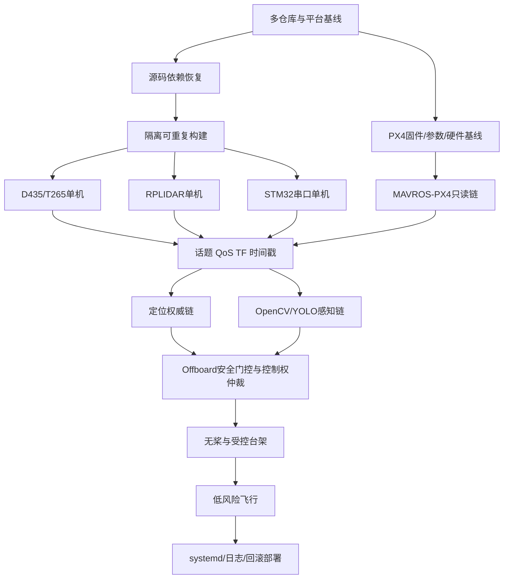

# 工程后续工作安排

> 分析日期：2026-07-23（Asia/Shanghai）  
> 工作区：`/home/c/px4_ws`  
> 本次操作边界：只读检查；未构建、未启动节点、未打开串口、未控制飞控；只生成本文件和 `docs/project_task_board.md`。

## 1. 执行摘要

当前工程处于“**静态集成审查完成、部分单设备验证完成、尚未形成可重复构建与系统联调闭环**”阶段。

- 整体可用性：29/100 的旧审查评分仍基本适用，但 RealSense 状态已有进展。D435 和 T265 曾在 2026-07-23 完成受控单机验证；当前检查时两台相机均未连接。
- 完整联调条件：**不具备**。核心原因是当前源码不可证明可重复构建、PX4 固件/参数基线缺失、串口/STM32 协议无对端证据、定位/TF 权威链未定义、完整 bringup 会自动进入具有解锁和模式切换能力的控制节点。
- PX4 控制测试条件：**不具备**。当前权威路径从实际 launch 看是 MAVROS，不是 DDS；但实机 PX4 版本、board、参数、failsafe、坐标标定和只读通信均未验证。
- 静态集成基础：ROS 2 Foxy 工作区结构、MAVROS、Offboard、bringup、RealSense、RPLIDAR、串口、视觉、Nav2/SLAM/RTAB-Map 源码或包入口存在；`colcon list` 当前发现 77 包。
- 已完成硬件证据：D435 640×480@15 在 USB 3.2 下通过；T265 pose/gyro/accel 在 USB 3.1 下通过。D435 30 Hz 仍有可重复的深度启动硬件通知。
- 明确阻塞：`offboard_cpp/CMakeLists.txt` 冲突标记；`map_msgs`、`image_geometry` 源码被整包删除；9/19 仓库 dirty；PX4 firmware、`px4_msgs`、Micro-XRCE-DDS Agent、STM32 工程均不在当前工作区。
- 当前最值得优先修复的问题：**恢复可重复、与实际部署一致的源码/版本基线，并解除 `offboard_cpp` 构建阻断**。没有这个基线，任何控制修复都无法被可靠验证或部署。
- 当前最不应该做的事：**直接启动 `start_all_2025TI.launch.py` 或进行 Offboard/自动起飞测试**。

结论建议：

1. 当前不适合直接重构核心控制代码；仅适合在基线冻结后做小范围、可测试的阻塞修复。
2. 应先补齐部署基线、协议、坐标系和安全操作文档。
3. 应先统一 PX4、ROS/MAVROS、RealSense 和多仓库版本来源。
4. 应先完成隔离、可回滚的纯软件构建闭环。
5. 构建闭环后再按单设备顺序验证硬件；RealSense 可沿用已有报告，RPLIDAR、STM32、PX4 仍需首次现场验证。

## 2. 本次分析范围

已检查：

- 工作区根目录、`src/`、`build/`、`install/`、`log/` 和 `docs/`。
- 19 个源码 Git 仓库的分支、HEAD、dirty/untracked/staged 和 remote 存在性。
- 79 个 `package.xml`，以及 `colcon list --base-paths src` 实际发现的 77 个包。
- 关键 launch、YAML、Offboard、串口、视觉、RPLIDAR、RealSense 和 MAVROS 源码/配置。
- 现有构建返回码、RealSense 现场报告、依赖清单和既有风险报告。
- 当前设备节点和 USB 拓扑；仅枚举，没有打开设备。

未执行：

- `colcon build/test`、SITL、HIL、完整 bringup。
- MAVROS、Offboard、RealSense、RPLIDAR、串口、STM32 节点启动。
- 飞控连接、解锁、切模、参数读取或写入。
- 依赖安装、udev/systemd 修改、固件烧录、Git 变更或网络更新。

证据口径：

- “已确认”表示有当前源码、配置、Git 状态、构建日志或现场报告支持。
- “历史已验证”表示报告中有受控运行证据，但当前设备不在线。
- “高概率”表示静态配置可合理推断，尚未现场复现。
- “待现场确认”表示缺少设备、固件、参数或运行日志。

## 3. 已读取的报告和文件

### 3.1 主审查报告（全文读取）

| 文件 | 日期 | 用途 |
|---|---|---|
| `docs/workspace_status/README.md` | 2026-07-21 | 总体状态、评分和审查边界 |
| `docs/workspace_status/01_repository_snapshot.md` | 2026-07-21 | 19 仓库版本和 dirty 状态 |
| `docs/workspace_status/02_architecture_and_modules.md` | 2026-07-21 | 伴随端模块与数据流 |
| `docs/workspace_status/03_build_and_targets.md` | 2026-07-21 | 构建系统、工具链、历史日志 |
| `docs/workspace_status/04_hardware_and_drivers.md` | 2026-07-21 | 硬件接口和驱动 |
| `docs/workspace_status/05_communication_interfaces.md` | 2026-07-21 | MAVROS、MAVLink、视觉链 |
| `docs/workspace_status/06_parameters_and_startup.md` | 2026-07-21 | 启动顺序和硬编码参数 |
| `docs/workspace_status/07_tests_and_validation.md` | 2026-07-21 | 测试、CI、历史构建证据 |
| `docs/workspace_status/08_risks_and_technical_debt.md` | 2026-07-21 | R-001 至 R-021 风险清单 |
| `docs/workspace_status/09_next_steps.md` | 2026-07-21 | 既有修复建议 |
| `docs/workspace_status/10_audit_manifest.md` | 2026-07-21 | 审查命令和范围清单 |

### 3.2 更新事实的报告（全文读取）

| 文件 | 日期 | 更新事实 |
|---|---|---|
| `docs/realsense_runtime_check.md` | 2026-07-23 | D435/T265 SDK、ROS、话题、TF、频率和多版本覆盖 |
| `docs/realsense_runtime_check_20260723_134606.md` | 2026-07-23 | T265 USB 3.1；D435 当时仍 USB 2.1 |
| `docs/realsense_d435_cable_check_20260723_140021.md` | 2026-07-23 | 最新 D435 换线后 USB 3.2；15 Hz PASS、30 Hz WARN |
| `docs/src_dependency_inventory.md` | 2026-07-21 | 19 仓库、2 个本地包、79 个 manifest 依赖 |
| `docs/uav_install_script_update.md` | 2026-07-21 | 版本锁定意图；同时说明 `px4_msgs`/Agent 是计划项而非当前存在项 |

### 3.3 直接核对的关键源码/配置

- `src/offboard_cpp/CMakeLists.txt`
- `src/offboard_cpp/src/2025_Ti_main.cpp`
- `src/offboard_cpp/include/lib/offboard_control_node.hpp`
- `src/offboard_cpp/src/lib/offboard_control_node.cpp`
- `src/offboard_py/offboard_py/px4_start_demo.py`
- `src/px4_bringup/launch/start_all_2025TI.launch.py`
- `src/px4_bringup/launch/serial_and_image_2025TI.launch.py`
- `src/px4_bringup/launch/include/px4_fly.launch.py`
- `src/px4_bringup/launch/include/px4.launch.py`
- `src/px4_bringup/config/mavros_params.yaml`
- `src/serial_driver_ros2/config/serial_config.yaml`
- `src/serial_driver_ros2/launch/serial_driver.launch.py`
- `src/serial_driver_ros2/include/serial_driver/protocol_defs.hpp`
- `src/serial_driver_ros2/src/serial_driver.cpp`
- `src/serial_driver_ros2/src/serial_orinnano.cpp`
- `src/rplidar_ros/launch/rplidar_a1_launch.py`
- `src/rplidar_ros/scripts/rplidar.rules`
- `src/ros2_foxy_vision_to_mavros/src/vision_to_mavros.cpp`
- `src/ros2_foxy_vision_to_mavros/launch/t265_tf_to_mavros_launch.py`
- `src/cv_yolo_paddle_pkg/cv_yolo_paddle_pkg/yolo_node.py`
- `src/cv_yolo_paddle_pkg/launch/yolo_node.launch.py`
- `src/opencv_cpp/launch/image.launch.py`
- `src/opencv_cpp/CMakeLists.txt`

## 4. 工作区总体结构

| 项目 | 当前事实 |
|---|---|
| 根目录 Git | 不是 Git 仓库 |
| 工作区类型 | ROS 2 Foxy / colcon 多仓库工作区 |
| 平台 | Jetson Orin Nano，Ubuntu 20.04.6，aarch64，Linux 5.10.104-tegra |
| 工具 | Python 3.8.10、GCC 9.4.0、CMake 3.16.3 |
| 源码仓库 | 19 个独立 Git 仓库 |
| 本地非 Git ROS 包 | `cv_yolo_paddle_pkg`、`opencv_cpp` |
| manifest / colcon 包 | 79 / 77 |
| 构建产物 | 根 `build/` 79 包目录、`install/` 77 包目录；均为历史产物 |
| 当前相关进程 | 仅 ROS 2 daemon；无 MAVROS/Offboard/RealSense/RPLIDAR/Agent 节点 |
| 当前硬件节点 | `/dev/ttyTHS0` 存在；`/dev/ttyUSB0`、`/dev/rplidar`、`/dev/video*` 不存在 |
| PX4 firmware 树 | 未发现 |
| STM32 工程 | 未发现 |
| systemd/项目级部署服务 | 未发现 |

源码树内存在生成物污染：`src/offboard_py/build`、`src/rtabmap/build`、`src/serial-ros2/build`、`src/ros2_foxy_vision_to_mavros/log`。第三方仓库也含 Docker/测试资产，但没有发现项目级可直接部署的 systemd 服务。

## 5. Git 仓库清单

当前状态与 2026-07-21 报告一致：10 clean、9 dirty、4 detached、所有 staged=0。remote 实时可达性未在本次联网验证。

| 仓库路径 | 功能 | 当前分支 | 当前提交 | 工作区状态 | 是否有远程仓库 |
|---|---|---|---|---|---|
| `src/gazebo_ros_pkgs` | Gazebo ROS 集成 | `foxy` | `b6f7bf121d0c` | clean | 是 |
| `src/imu_tools` | IMU 滤波/可视化 | `foxy` | `d28555e487e4` | clean | 是 |
| `src/librealsense` | RealSense SDK 2.50 | detached | `c94410a420b7` | 3347 tracked mode changes | 是 |
| `src/mavlink` | MAVLink 2022.12.30 | detached | `22b62f8d55fe` | 233 tracked、2 untracked | 是 |
| `src/mavros` | MAVROS 2.7.0 | detached | `48b53ccdf95f` | 325 tracked（含内容变更） | 是 |
| `src/navigation2` | Nav2 Foxy | `foxy-devel` | `ca482808a7a7` | clean | 是 |
| `src/navigation_msgs` | 导航消息 | `foxy` | `fe880e99d993` | `map_msgs` 13 项删除 | 是 |
| `src/offboard_cpp` | C++ Offboard/任务状态机 | `master` | `77a02dc09212` | 2 untracked | 是（2 个 remote） |
| `src/offboard_py` | Python Offboard 示例 | `master` | `38887f08dd91` | clean | 是 |
| `src/px4_bringup` | 系统启动编排 | `master` | `0fbdcbf6ee53` | clean | 是 |
| `src/realsense-ros` | ROS wrapper 4.0.4 | detached | `8abb4657c0ad` | 98 tracked、1 untracked | 是 |
| `src/ros2_foxy_vision_to_mavros` | T265→MAVROS | `main` | `3d395fdc0d03` | 1 tracked 修改 | 是 |
| `src/rplidar_ros` | RPLIDAR ROS 2 驱动 | `ros2` | `24cc9b6dea97` | clean | 是 |
| `src/rtabmap` | RTAB-Map core | `foxy-devel` | `0070de4aafab` | clean | 是 |
| `src/rtabmap_ros` | RTAB-Map ROS | `foxy-devel` | `b341e2a776a7` | clean | 是 |
| `src/serial-ros2` | serial 库 | `master` | `ae46504ae7d4` | clean | 是 |
| `src/serial_driver_ros2` | 自定义串口桥 | `main` | `8614989c8b9e` | 4 tracked、1 untracked | 是 |
| `src/slam_toolbox` | 2D SLAM | `foxy-devel` | `4786e90c06a4` | clean | 是 |
| `src/vision_opencv` | cv_bridge/image_geometry | `foxy` | `72152d9d1d8e` | `image_geometry` 17 项删除 | 是 |

子模块结论：19 个仓库当前 `git submodule status --recursive` 均无条目；未发现 gitlink。`mavlink/.gitmodules` 与索引内容存在历史元数据不一致，但不是未初始化 gitlink。

重复/旧副本：未发现第二套 PX4-Autopilot 或明显重复源码仓库；`build/librealsense2/third-party/libcurl/.git` 是生成目录内嵌套依赖，不计入源码仓库。

## 6. ROS 包和模块清单

### 6.1 ROS 识别

- ROS 2 Foxy；未发现活动 ROS 1 工作区。
- `gazebo_ros_pkgs/.ros1_unported` 和 `mavros/test_mavros` 是 ROS 1/旧测试内容，已由 `AMENT_IGNORE`/`COLCON_IGNORE` 排除。
- `rtabmap_msgs` 被 colcon 标识为 `ros.catkin`，是当前混合构建类型风险；`serial-ros2/tests` 仍含 `catkin_add_gtest`，但未注册到 ament 构建。
- 当前 `colcon list` 没有同名包冲突；79 manifest 与 77 包的差异来自被忽略内容。

### 6.2 功能分组

| 分组 | 实际包/仓库 | 当前判断 |
|---|---|---|
| 飞控通信 | `mavlink`、`mavros`、`mavros_msgs` | 源码和历史构建存在；实机链未验证 |
| 控制 | `offboard_cpp`、`offboard_py` | 有直接控制能力；C++ 当前源码重建阻塞 |
| 启动 | `px4_bringup` | 有唯一“全系统”入口，但不安全分级 |
| 外部视觉 | `librealsense2`、`realsense2_camera`、`vision_to_mavros` | 相机单机有现场证据；融合链未验证 |
| 雷达 | `rplidar_ros` | 驱动/launch 存在；硬件未验证 |
| 串口 | `serial`、`serial_driver` | 历史构建存在；协议/硬件未验证 |
| 感知 | `opencv_cpp`、`cv_yolo_paddle_pkg` | 本地非 Git 包；模型和 ROS 话题代码存在；性能/准确率未验证 |
| 定位导航 | Nav2、SLAM Toolbox、RTAB-Map、IMU tools | 第三方栈存在；未形成项目权威定位入口 |
| 仿真 | `gazebo_ros_pkgs` | ROS Gazebo 包存在；无 PX4 SITL 树和集成场景证据 |

### 6.3 构建状态

- 历史 `colcon_build.rc=0`：Offboard、bringup、vision、serial、RealSense、RPLIDAR、YOLO、OpenCV 等关键包均有旧成功产物。
- 这些产物最晚为 2025-12-29，早于部分当前修改；不能证明当前源码通过。
- 当前确认的构建阻断：
  - `src/offboard_cpp/CMakeLists.txt:125-134` 含冲突标记。
  - `map_msgs` 和 `image_geometry` 的 tracked 源码被删除，可能阻断 Nav2/RTAB-Map。
  - package metadata 不完整，旧 install 和 `/usr/local` 依赖可能掩盖问题。
- 本次未运行构建，以避免写入 `build/install/log`。

## 7. 硬件和驱动清单

| 模块 | 源码/配置 | 现场证据 | 当前状态 |
|---|---|---|---|
| Jetson Orin Nano | 当前主机 | OS/架构已确认 | 已确认 |
| PX4 飞控 | MAVROS `/dev/ttyTHS0:921600` | 设备节点存在；未握手 | 待现场确认 |
| D435 | librealsense/realsense-ros | 2026-07-23 USB 3.2；640×480@15 PASS | 历史已验证；当前未连接 |
| T265 | realsense-ros + vision bridge | 2026-07-23 USB 3.1；pose/gyro/accel PASS | 历史已验证；当前未连接 |
| RPLIDAR A1 配置 | `rplidar_a1_launch.py`，115200，frame `laser` | 当前无 `/dev/ttyUSB0`/`/dev/rplidar` | 仅代码/驱动 |
| STM32 | 串口配置 `/dev/ttyUSB0:115200` | 固件、型号、协议文档、设备均缺失 | 阻塞 |
| 普通 USB 相机 | OpenCV 默认 `/dev/usb_camera` | 当前节点不存在；未发现对应 udev | 仅代码/驱动 |

RPLIDAR 与自定义串口默认都使用 `/dev/ttyUSB0`，存在设备顺序变化和争用。RPLIDAR 源码带 `10c4:ea60`→`/dev/rplidar` 规则，但 active launch 未使用稳定名，规则安装状态也未验证。

## 8. 当前已确认状态

1. 工作区是 ROS 2 Foxy 伴随计算机工程，不是 PX4 firmware 工程。
2. 当前飞控权威链路从 active launch 看是 `T265 → vision_to_mavros → MAVROS → /dev/ttyTHS0 → 外部 PX4`。
3. 工作区没有 `px4_msgs`、Micro-XRCE-DDS Agent、`/fmu/in/*`、`/fmu/out/*` 或 `OffboardControlMode` 实现；DDS 只是安装文档中的未来计划。
4. active bringup 在 25 秒后启动 `2025_Ti_main_node`；该节点能够请求 OFFBOARD、解锁、发布位置/速度 setpoint 和请求 AUTO.LAND。
5. Offboard 控制周期 20 Hz，使用 MAVROS `SensorDataQoS` 接收 pose/velocity，但没有接收时间、新鲜度和有限值门控。
6. MAVROS 配置为 MAVLink v2、`/dev/ttyTHS0:921600`、无 GCS URL、`respawn=false`。
7. RealSense 单机基础链已实际验证，但生产入口未绑定序列号，SDK 有 dpkg 2.56.5、`/usr/local` 2.50、workspace 2.50 三来源。
8. D435 15 Hz 稳定配置通过；30 Hz 有重复 `Depth stream start failure` 通知。
9. 串口协议不是 CRC，而是对整帧求和后取低 8 位；没有协议版本字段。
10. YOLO 节点订阅 `/image`，强制使用 CUDA，模型路径和视频输出路径硬编码到当前工作区；5 个 `.pt` 文件约 60 MB，所在包没有 Git 元数据。
11. Nav2、SLAM Toolbox、RTAB-Map 存在，但主 bringup 没有启动它们，当前权威定位源仍是 T265/MAVROS vision 路径。
12. 自定义包主要依赖 ROS 日志字符串；未形成统一状态码、`diagnostic_msgs` 健康树、日志轮转或故障恢复规范。

## 9. 尚未确认的信息

- PX4 firmware 精确版本、是否为 1.16.x、board target、参数快照、airframe、failsafe、EKF 外部视觉配置。
- 飞控端 UART、921600 波特率、电平、流控、线序和实际 MAVROS 握手。
- RC 输入、RC kill、地面站、遥控器、GPS、电池、estimator health 的实机状态。
- DDS 是否会在另一工作区或系统服务中运行；当前工作区没有证据。
- STM32 型号、HAL/LL、编译器、工程、协议版本、字节序、对齐、浮点/定点规则和 CRC 约定。
- RPLIDAR 实际型号是否确为 A1、序列号、设备名、TF 安装位姿和 scan 频率。
- T265 相机实际安装方向与 `yaw/gamma=0` 的标定依据。
- D435 点云、深度对齐、RTAB-Map 链、长时间稳定性和多相机并发资源。
- YOLO 模型来源、训练数据、类别定义、准确率、延迟、GPU/内存占用和部署许可。
- map/odom/base_link/camera_link/laser 的完整 TF 树及唯一发布者。
- 是否有工作区外的 systemd、udev、PX4 源码、STM32 仓库或部署脚本正在使用。

## 10. 已确认问题

### A. 已确认问题

| ID | 优先级 | 问题 | 证据 |
|---|---|---|---|
| A-01 | P0 | Offboard CMake 含冲突标记，当前源码不能可靠重建 | `src/offboard_cpp/CMakeLists.txt:125-134` |
| A-02 | P0 | PX4 firmware/参数/board 基线缺失 | 工作区未发现 PX4-Autopilot 特征树 |
| A-03 | P0 | 串口奇数长度 payload 可越界；协议仅 8 位求和 | `serial_driver.cpp:81-104`；`protocol_defs.hpp:9-18` |
| A-04 | P0 | 单值 `0x99` 可发布 `/start_flight=true` | `serial_orinnano.cpp:121-127` |
| A-05 | P0 | Offboard 遥测无 freshness/finite gate | `offboard_control_node.cpp:35-45,73-79` |
| A-06 | P0 | 禁飞区 ID 缺范围校验，动态更新不重规划 | `2025_Ti_main.cpp:88-133,408-487` |
| A-07 | P0 | Landing 状态可高频重复异步请求，响应未处理 | `2025_Ti_main.cpp:506-517` |
| A-08 | P1 | `map_msgs`、`image_geometry` 被整包删除 | 两仓库 Git 状态 |
| A-09 | P1 | 9/19 仓库 dirty，4 detached，无根级可复现 commit | 当前 Git 清单 |
| A-10 | P1 | RealSense SDK 三来源覆盖 | RealSense 运行报告与动态链接证据 |
| A-11 | P1 | 视觉 Path 100 Hz 无界增长 | `vision_to_mavros.cpp:157-160` |
| A-12 | P1 | RPLIDAR 与 STM32 默认共享 `/dev/ttyUSB0` | 两份 launch/YAML |
| A-13 | P1 | 全系统 launch 以固定延时启动安全关键节点 | `start_all_2025TI.launch.py` |
| A-14 | P2 | 源码树内存在 build/log 生成物 | `src/*/build`、`src/.../log` |
| A-15 | P2 | 两个本地视觉包无 Git；模型和绝对路径不可复现 | `src/cv_yolo_paddle_pkg`、`src/opencv_cpp` |
| A-16 | P2 | 自定义模块无统一诊断/错误码/CI | package/CMake/源码扫描 |

## 11. 高概率问题

### B. 高概率问题

1. 当前旧 `install/` 可能与源码不一致；直接运行可能执行旧二进制。
2. 干净构建会暴露 package manifest 缺依赖和 `/usr/local/lib/libserial.a` 隐式依赖。
3. T265 100 Hz、queue 256 和无界 Path 在长航时会增加延迟、CPU、内存和 DDS 带宽。
4. 多个 C++/Python Offboard 节点若误启，会竞争同名 MAVROS setpoint/service。
5. 未验证的相机旋转参数可能使外部视觉轴向错误。
6. D435、T265、YOLO、点云和 SLAM 并发时可能超过 USB/GPU/内存预算。
7. 串口构造时直接打开设备且无重连策略，设备缺失会使 bringup 失败或不可恢复。
8. `rtabmap_msgs` 的 catkin 类型、缺失 `image_geometry` 和混合历史生成物可能阻断完整工作区构建。

## 12. 历史遗留和技术债

### D. 历史遗留

- Python Offboard demo、C++ demo、`new.cpp`、`offboard_layered_example.cpp` 和空 Action 实现并存。
- `offboard_layered_example.cpp`、`new.cpp` 未跟踪且未进入 CMake。
- `install/serial_driver` 有悬空 launch symlink 和旧 executable。
- `t265_all_nodes_launch.py` 硬编码旧 USB port `2-2`，还会同时启动 MAVROS。
- 主 bringup、RealSense 通用入口、T265 专用入口和 all-nodes 入口用途重叠，缺少权威入口声明。
- 视觉/串口源码有 whitespace 和编码质量问题；包版本/描述不完整。
- 源码树内保留 build/log；历史 `colcon.meta` 已丢失。
- `cv_yolo_paddle_pkg` 名称包含 Paddle，但实现使用 Ultralytics/PyTorch YOLO。
- 模型重复存放，没有校验和、版本、许可证和发布策略。

## 13. 安全风险

### E. 安全风险

| 风险 | 等级 | 影响 | 当前控制措施 |
|---|---|---|---|
| 完整 bringup 自动启动可解锁控制节点 | 严重 | 飞控/电机/执行器 | 本阶段禁止运行 |
| `0x99` 串口命令触发飞行开始 | 严重 | 任务状态机推进 | 设备当前未连接；仍需代码和协议双重修复 |
| 遥测陈旧/NaN 推进状态机 | 严重 | 错误起飞、航点或降落 | 未修复 |
| 坐标/外部视觉方向未标定 | 严重 | 位置估计和控制方向错误 | 未进入控制验证 |
| 多控制发布者竞争 | 高 | setpoint 冲突 | 默认 launch 只启动一个，但无互斥 |
| 串口设备名冲突 | 高 | 误开 STM32/RPLIDAR | 当前设备未连接 |
| PX4 failsafe/RC kill 未知 | 严重 | 失联时行为不可预测 | 必须先取参数和无桨验证 |
| D435 30 Hz 启动硬件通知 | 中 | 感知数据中断/延迟 | 暂定 15 Hz 稳定配置 |

## 14. 模块依赖关系

实际依赖主线：

```text
多仓库/OS/ROS/PX4/硬件基线
    ↓
源码与依赖恢复（Offboard 冲突、缺失包、SDK 来源）
    ↓
隔离可重复构建
    ↓
单设备验证（D435/T265 → RPLIDAR → STM32 → PX4 只读）
    ↓
ROS 话题/QoS/TF/时间戳与诊断
    ↓
定位权威链（当前候选：T265→MAVROS；SLAM/RTAB-Map 尚未选定）
    ↓
感知链（普通相机→OpenCV/YOLO；D435 深度链另行验证）
    ↓
安全控制逻辑、控制权仲裁和 failsafe
    ↓
无桨/台架/低风险飞行
    ↓
部署、开机启动和维护
```



## 15. Phase 0：工程基线冻结

| 项目 | 内容 |
|---|---|
| 输入 | 当前 19 仓库、现有 reports、设备清单、飞控维护信息 |
| 主要任务 | P0-001、P0-002、P0-003 |
| 输出 | 仓库锁定清单、dirty 差异包、PX4/硬件/参数清单、权威控制路径和安全规则 |
| 验收标准 | 能精确回答每个仓库/包/设备/固件版本、谁能发控制、如何回滚 |

## 16. Phase 1：纯软件构建闭环

| 项目 | 内容 |
|---|---|
| 输入 | Phase 0 基线；不连接硬件 |
| 主要任务 | P0-004、P1-001、P1-002、P2-004 |
| 输出 | 隔离 build/install/log、依赖失败矩阵、版本策略、可重复命令 |
| 验收标准 | 核心自定义包在空生成目录构建为 0；每个失败有唯一原因和处置方案 |

## 17. Phase 2：单设备最小化验证

| 项目 | 内容 |
|---|---|
| 输入 | 可重复构建；每次只接一个设备 |
| 主要任务 | P1-004、P1-005、P1-006、P1-007 |
| 输出 | 序列号、端口、版本、频率、资源和故障日志 |
| 验收标准 | 每个设备独立稳定运行；不发送飞行控制指令 |

## 18. Phase 3：ROS 数据链路验证

| 项目 | 内容 |
|---|---|
| 输入 | 单设备通过 |
| 主要任务 | P1-008、P1-009、P1-010、P2-002 |
| 输出 | topic/type/QoS/频率/时间戳/TF/诊断接口表 |
| 验收标准 | 每条链有可重复的输入、输出、频率、最大 age 和失败表现 |

## 19. Phase 4：模块集成

| 项目 | 内容 |
|---|---|
| 输入 | 构建、单设备和数据链通过 |
| 主要任务 | P1-003、P0-006、P1-010 |
| 输出 | 分级 bringup、readiness gate、控制权仲裁、安全状态机 |
| 验收标准 | 依赖未 ready 时控制节点不能启动；任一关键输入失效进入确定安全状态 |

## 20. Phase 5：系统级联调

| 项目 | 内容 |
|---|---|
| 输入 | 模块级集成通过 |
| 主要任务 | P2-003、P2-001 |
| 输出 | 多设备 soak、资源预算、故障注入、恢复矩阵 |
| 验收标准 | 重复启动成功；CPU/内存/USB/频率有界；单点失败可诊断并可恢复 |

## 21. Phase 6：PX4 安全控制验证

严格按以下闸门串行推进，任何一步失败都停止：

| 级别 | 前置条件 | 安全条件 | 通过标准 | 停止条件 |
|---|---|---|---|---|
| 6.1 只读状态 | P0-002/P1-007 | 不发布 setpoint、不调用服务 | state、电池、RC、estimator、timesync 可记录 | 串口掉线、版本不明 |
| 6.2 链路选择 | P0-003 | MAVROS/DDS 只保留一个权威路径 | 无重复控制端，topic/service 清单冻结 | 发现第二控制路径 |
| 6.3 时间同步 | P1-008 | 飞控未解锁 | timesync 稳定、消息 age 在门限内 | 时间跳变/漂移超限 |
| 6.4 坐标系 | P1-008 | 拆桨或隔离执行器 | 逐轴移动方向、尺度、yaw 一致 | 任一轴符号/尺度不一致 |
| 6.5 Offboard 心跳 | P0-006 | 禁止 arm；只验证心跳和拒绝路径 | 心跳频率稳定，断流触发预期 failsafe | 模式意外切换/执行器动作 |
| 6.6 无桨测试 | 前五级通过 | 拆桨、RC kill、急停、两人复核 | arm/mode/setpoint/failsafe 日志符合预期 | 任一不可解释状态 |
| 6.7 受控台架 | 无桨测试通过 | 固定机体、隔离区域、监护人 | 有限动作与停止条件可重复 | 振动、估计发散、失联 |
| 6.8 低风险飞行 | 台架和风险评审通过 | 开阔场地、低高度、手动接管 | 预定义短任务和 failsafe 通过 | 任一告警、漂移、接管异常 |

本阶段主要任务：P0-006 和 P1-007。禁止用“一键自动起飞”作为首次验证方式。

## 22. Phase 7：部署和维护

| 项目 | 内容 |
|---|---|
| 输入 | Phase 5/6 验证结果 |
| 主要任务 | P2-005 |
| 输出 | systemd、设备命名、配置版本、日志轮转、回滚、现场手册 |
| 验收标准 | 冷启动可重复；服务默认不自动进入控制；版本和配置可追溯、一键回滚 |

## 23. 完整任务清单

以下“建议命令”均是未来执行建议，本次没有执行。含硬件或飞控的命令只能在对应 Phase、安全条件和授权下运行。

### P0-001

| 字段 | 内容 |
|---|---|
| 任务编号 / 所属阶段 / 优先级 / 模块 | P0-001 / Phase 0 / P0 / 工程基线 |
| 任务名称 | 冻结多仓库和本地源码基线 |
| 当前状态 / 证据 | 根无 Git；19 仓库，9 dirty、4 detached；2 个本地包无 Git。证据：第 5 节和 `01_repository_snapshot.md` |
| 问题描述 / 目标 | 当前组合不能从单一 revision 重建；目标是保存 commit、真实内容差异、未跟踪文件和本地包校验和 |
| 前置条件 / 依赖任务 / 阻塞任务 | 只读快照空间 / 无 / 阻塞全部任务 |
| 是否可并行 | 否；必须先形成基线 |
| 建议步骤 | 1. 导出仓库表；2. 分离 mode 噪声与内容差异；3. 打包未提交变更；4. 为本地包建清单；5. 在独立位置验证恢复 |
| 建议命令 | `git -C <repo> status --short --branch`；`git -C <repo> diff --binary > <backup>/<repo>.patch`；`sha256sum <local-files>` |
| 预期结果 / 通过标准 | 任一仓库和本地包都能恢复到本次状态；全新目录核对 commit 和文件校验和一致 |
| 失败表现 / 排查顺序 | patch 缺未跟踪文件、mode 噪声混入；先核对 status→untracked→binary diff→校验和 |
| 风险等级 / 是否连接硬件 / 所需硬件 | 中 / 否 / 无 |
| 是否需要 sudo / 是否修改文件 / 是否影响飞控 | 否 / 是（未来生成清单/备份） / 否 |
| 回滚方式 / 建议产出 | 不改原仓库；删除独立快照即可 / `workspace_baseline.md`、patch 包、SHA256 清单 |

### P0-002

| 字段 | 内容 |
|---|---|
| 任务编号 / 所属阶段 / 优先级 / 模块 | P0-002 / Phase 0 / P0 / PX4/硬件 |
| 任务名称 | 获取实际 PX4 firmware、board 和参数基线 |
| 当前状态 / 证据 | 工作区没有 PX4-Autopilot；版本、board、参数、failsafe 未知 |
| 问题描述 / 目标 | 无法判断 1.16.x、MAVLink/DDS 兼容和安全参数；目标是取得精确 commit/tag、submodule、board target、参数导出、飞控日志 |
| 前置条件 / 依赖任务 / 阻塞任务 | 飞控维护者参与；先不写参数 / P0-001 / P0-003、P1-007、P0-006、Phase 6 |
| 是否可并行 | 可与纯软件仓库盘点并行 |
| 建议步骤 | 1. 记录飞控型号；2. 从部署来源确认固件 SHA；3. 导出只读参数；4. 记录 RC/kill/failsafe；5. 对照 MAVROS 版本 |
| 建议命令 | 独立固件树：`git describe --always --dirty`、`git submodule status --recursive`；飞控参数导出仅由合格人员在 QGC 中执行 |
| 预期结果 / 通过标准 | 固件可按相同 board 构建；参数快照可追溯；明确是否 1.16.x |
| 失败表现 / 排查顺序 | 只有版本号无 SHA、参数来源不明；先查发布记录→飞控日志→构建产物元数据→维护者 |
| 风险等级 / 是否连接硬件 / 所需硬件 | 高 / 是 / 飞控、数据线、QGC 主机 |
| 是否需要 sudo / 是否修改文件 / 是否影响飞控 | 否 / 是（只生成快照） / 是（只读阶段禁止写参数） |
| 回滚方式 / 建议产出 | 不写飞控，无需回滚 / firmware manifest、参数文件、board/airframe/RC/failsafe 清单 |

### P0-003

| 字段 | 内容 |
|---|---|
| 任务编号 / 所属阶段 / 优先级 / 模块 | P0-003 / Phase 0 / P0 / 控制架构 |
| 任务名称 | 冻结唯一权威控制链和安全边界 |
| 当前状态 / 证据 | active launch 走 MAVROS；工作区无 DDS；多个 Offboard demo 可竞争 |
| 问题描述 / 目标 | 安装文档计划 DDS，但当前实现是 MAVROS；目标是正式声明生产链、备用链、禁用入口和控制权所有者 |
| 前置条件 / 依赖任务 / 阻塞任务 | 架构负责人决策 / P0-001、P0-002 / P1-003、P0-006、P1-007 |
| 是否可并行 | 否；需在控制相关改动前完成 |
| 建议步骤 | 1. 列出所有 setpoint/service 发布者；2. 选择 MAVROS 或 DDS；3. 标记 demo/实验入口；4. 定义 lease/互斥；5. 定义无授权默认禁用 |
| 建议命令 | `grep -RInE 'setpoint|arming|set_mode|/fmu/' src/offboard_* src/px4_bringup` |
| 预期结果 / 通过标准 | 生产启动中仅一个控制 owner；DDS/MAVROS 不会同时控制 |
| 失败表现 / 排查顺序 | 文档与 launch 不一致；先查 launch→可执行列表→topic/service→systemd 外部入口 |
| 风险等级 / 是否连接硬件 / 所需硬件 | 严重 / 否 / 无 |
| 是否需要 sudo / 是否修改文件 / 是否影响飞控 | 否 / 是（架构/启动文档，后续代码） / 是 |
| 回滚方式 / 建议产出 | 保留原 launch，新增显式 profile 后切换 / 控制架构 ADR、控制入口白名单 |

### P0-004

| 字段 | 内容 |
|---|---|
| 任务编号 / 所属阶段 / 优先级 / 模块 | P0-004 / Phase 1 / P0 / ROS 构建 |
| 任务名称 | 解除 Offboard 冲突并处置缺失依赖包 |
| 当前状态 / 证据 | CMake 冲突标记；`map_msgs`/`image_geometry` tracked 删除 |
| 问题描述 / 目标 | 当前源码无法证明可配置；目标是经人工确认后恢复一致源码树 |
| 前置条件 / 依赖任务 / 阻塞任务 | 基线备份、确认删除意图和目标 executable / P0-001 / P1-001、所有集成任务 |
| 是否可并行 | 否；涉及同一构建基线 |
| 建议步骤 | 1. 比较 HEAD/工作差异；2. 人工选择 CMake 目标；3. 确认两包删除意图；4. 仅在授权后修复；5. 隔离构建 |
| 建议命令 | `grep -nE '^(<<<<<<<|=======|>>>>>>>)' src/offboard_cpp/CMakeLists.txt`；`git -C <repo> diff -- <path>` |
| 预期结果 / 通过标准 | 无冲突标记；包来源明确；`offboard_cpp` CMake configure 通过 |
| 失败表现 / 排查顺序 | target 重复/缺失、依赖找不到；CMake→package.xml→缺失包→overlay 顺序 |
| 风险等级 / 是否连接硬件 / 所需硬件 | 高 / 否 / 无 |
| 是否需要 sudo / 是否修改文件 / 是否影响飞控 | 否 / 是 / 间接影响控制软件 |
| 回滚方式 / 建议产出 | 用 P0-001 patch/快照恢复 / 审批 diff、单包构建日志 |

### P0-005

| 字段 | 内容 |
|---|---|
| 任务编号 / 所属阶段 / 优先级 / 模块 | P0-005 / Phase 1-2 / P0 / 串口/STM32 |
| 任务名称 | 固化版本化串口协议并消除飞行触发漏洞 |
| 当前状态 / 证据 | STM32 工程缺失；8 位求和；奇数帧越界；缩放注释/实现不一致；`0x99` 触发飞行 |
| 问题描述 / 目标 | 两端协议不可证明一致；目标是版本、帧长、类型、序号、时效、CRC、字节序、缩放和状态许可统一 |
| 前置条件 / 依赖任务 / 阻塞任务 | 获得 STM32 源码/协议；先禁用飞行触发 / P0-001 / P1-006、P0-006、Phase 4 |
| 是否可并行 | 协议文档与构建修复可并行；硬件对测串行 |
| 建议步骤 | 1. 取得 MCU 工程；2. 写 wire spec；3. 建 golden frames；4. fuzz 边界/分片/粘包；5. 双重许可替代单值命令；6. 再硬件对测 |
| 建议命令 | 纯软件：协议单测/ASan target；硬件阶段只读抓帧工具，禁止先发送控制帧 |
| 预期结果 / 通过标准 | 双端 golden frame 100% 一致；坏帧/重放/过期帧不发布 `/start_flight`；无越界 |
| 失败表现 / 排查顺序 | 长度、端序、缩放、CRC 不同；先版本→帧头→长度→端序→单位→校验→时序 |
| 风险等级 / 是否连接硬件 / 所需硬件 | 严重 / 是（最终验收） / STM32、USB-UART/逻辑分析仪 |
| 是否需要 sudo / 是否修改文件 / 是否影响飞控 | 否 / 是 / 是（任务启动入口） |
| 回滚方式 / 建议产出 | 保留旧协议只读解析器和版本协商，禁止静默降级 / 协议规范、golden vectors、fuzz/对测日志 |

### P0-006

| 字段 | 内容 |
|---|---|
| 任务编号 / 所属阶段 / 优先级 / 模块 | P0-006 / Phase 4-6 / P0 / PX4 Offboard |
| 任务名称 | 建立 Offboard 安全门控、仲裁和确定性降级 |
| 当前状态 / 证据 | 无 freshness/finite/estimator gate；禁飞区越界；LAND 请求无界；多控制入口 |
| 问题描述 / 目标 | 陈旧/错误输入可推进状态机；目标是只有健康、唯一 owner、连续新鲜数据才能切模/解锁 |
| 前置条件 / 依赖任务 / 阻塞任务 | 定义 HOLD/LAND/人工接管策略 / P0-002、P0-003、P0-004、P1-008 / Phase 6.5-6.8 |
| 是否可并行 | 单元测试与设计可并行；实机验证必须串行 |
| 建议步骤 | 1. 记录 state/pose/velocity age；2. finite/received/estimator gate；3. 校验禁飞区并动态 HOLD；4. 有界 service future/退避；5. 控制权 lease；6. 故障注入；7. 无桨验证 |
| 建议命令 | 纯软件/SITL：注入 stale、NaN、TF loss、service reject；实机不提供一键 arm 命令，按批准检查单操作 |
| 预期结果 / 通过标准 | 未满足全部门限时无法 arm/推进；故障在规定时间进入 HOLD/LAND/人工接管；无请求风暴 |
| 失败表现 / 排查顺序 | 状态机继续、future 增长、模式不符；输入 age→owner→service response→PX4 failsafe→RC |
| 风险等级 / 是否连接硬件 / 所需硬件 | 严重 / 是（Phase 6 后段） / PX4、拆桨台架、RC kill |
| 是否需要 sudo / 是否修改文件 / 是否影响飞控 | 否 / 是 / 是 |
| 回滚方式 / 建议产出 | feature flag 默认安全禁用；回滚到只读模式 / 安全状态机图、单测/SITL/无桨日志、安全评审 |

### P1-001

| 字段 | 内容 |
|---|---|
| 任务编号 / 所属阶段 / 优先级 / 模块 | P1-001 / Phase 1 / P1 / ROS 构建 |
| 任务名称 | 在隔离生成目录完成核心包构建闭环 |
| 当前状态 / 证据 | 只有旧 rc=0；当前完整构建未执行 |
| 问题描述 / 目标 | 旧 install 掩盖源码/依赖漂移；目标是不覆盖现有产物完成可重复 build |
| 前置条件 / 依赖任务 / 阻塞任务 | 无相关节点运行、资源预算、审查 post-build / P0-004、P1-002 / 所有运行验证 |
| 是否可并行 | 包组可分批，但共享依赖需按拓扑 |
| 建议步骤 | 1. 创建独立 workspace/生成目录；2. `colcon list/graph`；3. 先接口/库；4. 传感器；5. 自定义包；6. 记录每个失败 |
| 建议命令 | `colcon graph --base-paths src`；未来在独立副本执行 `colcon build --packages-up-to <core-packages>` |
| 预期结果 / 通过标准 | 核心包从空 build/install/log 返回 0，两次重复结果一致 |
| 失败表现 / 排查顺序 | 找不到包/库、catkin 冲突、ABI；环境→manifest→版本→CMake cache→链接 |
| 风险等级 / 是否连接硬件 / 所需硬件 | 中 / 否 / 无 |
| 是否需要 sudo / 是否修改文件 / 是否影响飞控 | 否 / 是（独立生成物） / 否 |
| 回滚方式 / 建议产出 | 删除独立生成目录，不碰现有 build/install/log / 构建矩阵、日志、依赖图 |

### P1-002

| 字段 | 内容 |
|---|---|
| 任务编号 / 所属阶段 / 优先级 / 模块 | P1-002 / Phase 1 / P1 / 依赖/版本 |
| 任务名称 | 统一依赖声明与 RealSense SDK 来源 |
| 当前状态 / 证据 | package.xml 缺运行依赖；libserial 来自 `/usr/local`；RealSense 三来源 |
| 问题描述 / 目标 | 环境顺序改变会切换 ABI/行为；目标是每个依赖有唯一来源和锁定版本 |
| 前置条件 / 依赖任务 / 阻塞任务 | 不在生产设备直接卸载；先列回滚 / P0-001 / P1-001、P1-004 |
| 是否可并行 | 可与协议文档并行 |
| 建议步骤 | 1. `ldd`/package inventory；2. 选择 SDK 2.50 或经兼容验证的版本；3. 补 manifests；4. 锁定 rosdep/apt；5. 独立环境验证 |
| 建议命令 | `ldd <binary>`；`dpkg -l | grep librealsense`；`rosdep check --from-paths src --ignore-src`（只读检查） |
| 预期结果 / 通过标准 | wrapper 构建/运行加载唯一 SDK；干净依赖检查无隐式缺项 |
| 失败表现 / 排查顺序 | ABI 错误、加载旧 so；`which`→`ldd`→`LD_LIBRARY_PATH`→ament prefix→dpkg |
| 风险等级 / 是否连接硬件 / 所需硬件 | 高 / 否（最终相机回归需硬件） / D435/T265 用于回归 |
| 是否需要 sudo / 是否修改文件 / 是否影响飞控 | 最终系统包变更可能需要，本任务先否 / 是 / 间接影响外部视觉 |
| 回滚方式 / 建议产出 | 记录现有 so、包版本和环境；在独立镜像先试 / dependency lock、动态链接报告 |

### P1-003

| 字段 | 内容 |
|---|---|
| 任务编号 / 所属阶段 / 优先级 / 模块 | P1-003 / Phase 4 / P1 / Bringup |
| 任务名称 | 拆分开发、设备测试、只读飞控和正式飞行启动入口 |
| 当前状态 / 证据 | 唯一全入口固定延时并自动启动控制节点 |
| 问题描述 / 目标 | 设备失败仍可能进入控制；目标是显式 profile、readiness gate、默认无控制 |
| 前置条件 / 依赖任务 / 阻塞任务 | 权威链决策、核心构建通过 / P0-003、P1-001 / P2-003、Phase 6 |
| 是否可并行 | 可与诊断接口设计并行 |
| 建议步骤 | 1. 列出 profile；2. 默认 sensor/read-only；3. lifecycle/readiness；4. 关键失败阻断控制；5. 启动图和参数审计 |
| 建议命令 | `ros2 launch <package> <profile>.launch.py --show-args`；launch test 模拟依赖缺失 |
| 预期结果 / 通过标准 | 默认入口不 arm、不切模；未 ready 时控制进程不存在；每种模式独立可测 |
| 失败表现 / 排查顺序 | 固定 Timer 残留、错误 profile 启动；launch graph→参数→事件→进程→topic |
| 风险等级 / 是否连接硬件 / 所需硬件 | 严重 / 否（静态/launch test） / 无 |
| 是否需要 sudo / 是否修改文件 / 是否影响飞控 | 否 / 是 / 是 |
| 回滚方式 / 建议产出 | 保留旧入口但重命名为 legacy 且禁止生产使用 / launch profiles、启动矩阵、launch tests |

### P1-004

| 字段 | 内容 |
|---|---|
| 任务编号 / 所属阶段 / 优先级 / 模块 | P1-004 / Phase 2 / P1 / RealSense |
| 任务名称 | 固化 D435/T265 单设备稳定配置 |
| 当前状态 / 证据 | D435 15 Hz PASS、30 Hz WARN；T265 USB 3 pose/IMU PASS；当前未连接 |
| 问题描述 / 目标 | 入口/序列号/SDK/USB 配置不唯一；目标是设备绑定、稳定 profile 和资源基线 |
| 前置条件 / 依赖任务 / 阻塞任务 | SDK 来源明确、每次只接一台 / P1-002 / P1-008、P1-009、P2-003 |
| 是否可并行 | D435/T265 报告分析可并行，现场测试按 USB 资源串行 |
| 建议步骤 | 1. 记录序列号/端口；2. D435 从 15 Hz 基线；3. T265 pose-only/IMU；4. 绑定 serial_no；5. 30-60 min soak；6. 再逐项点云/对齐 |
| 建议命令 | `lsusb -t`；`rs-enumerate-devices -s`；最小化 `ros2 launch realsense2_camera rs_launch.py ...`（仅硬件阶段） |
| 预期结果 / 通过标准 | USB 5000M；目标频率偏差≤5%；无 reset；消息/CameraInfo/TF 有效；age 有界 |
| 失败表现 / 排查顺序 | 2.1 降速、depth-start、UVC -32；线材/端口→SDK→profile→系统负载→固件 |
| 风险等级 / 是否连接硬件 / 所需硬件 | 中 / 是 / D435、T265、USB 3 线/端口 |
| 是否需要 sudo / 是否修改文件 / 是否影响飞控 | 否 / 否（验证）；后续参数文件是 / 外部视觉间接影响 |
| 回滚方式 / 建议产出 | 回到 D435 640×480@15、T265 pose-only / 单设备报告、稳定参数 YAML、资源曲线 |

### P1-005

| 字段 | 内容 |
|---|---|
| 任务编号 / 所属阶段 / 优先级 / 模块 | P1-005 / Phase 2 / P1 / RPLIDAR |
| 任务名称 | 验证具体雷达型号、稳定设备名和 LaserScan |
| 当前状态 / 证据 | A1 launch、115200、frame `laser`；当前设备不在；udev symlink 未采用 |
| 问题描述 / 目标 | 型号和设备名未知，且与 STM32 争用；目标是唯一 symlink、正确波特率、TF 和 scan 质量 |
| 前置条件 / 依赖任务 / 阻塞任务 | P1-001；只接雷达 / P1-001 / P1-008、P1-010、P2-003 |
| 是否可并行 | 可与无硬件构建任务并行 |
| 建议步骤 | 1. 读铭牌/序列；2. 枚举 VID/PID；3. 临时显式端口最小启动；4. 测频率/range；5. 设计稳定名；6. 验证 TF |
| 建议命令 | `ls -l /dev/serial/by-id/`；`udevadm info <device>`；`ros2 topic hz /scan`（仅设备阶段） |
| 预期结果 / 通过标准 | 重插后设备名不变；`/scan` 连续、频率和范围符合型号；无串口争用 |
| 失败表现 / 排查顺序 | health error/无 scan/权限；型号→供电→端口→波特率→权限→frame/TF |
| 风险等级 / 是否连接硬件 / 所需硬件 | 中 / 是 / RPLIDAR、USB 串口线 |
| 是否需要 sudo / 是否修改文件 / 是否影响飞控 | udev 部署时可能需要，验证阶段否 / 后续是 / 否 |
| 回滚方式 / 建议产出 | 不安装规则时用 `/dev/serial/by-id`；移除新规则并 reload / 型号/序列/频率日志、udev 方案 |

### P1-006

| 字段 | 内容 |
|---|---|
| 任务编号 / 所属阶段 / 优先级 / 模块 | P1-006 / Phase 2-3 / P1 / 串口/STM32 |
| 任务名称 | STM32 单设备双向通信与断线恢复验证 |
| 当前状态 / 证据 | 当前无设备/固件；节点直接打开 `/dev/ttyUSB0`，无持久 parser/reconnect |
| 问题描述 / 目标 | 驱动存在不等于协议可用；目标是只读→非控制回环→业务帧的分级验证 |
| 前置条件 / 依赖任务 / 阻塞任务 | P0-005 完成；禁用飞行触发 / P0-005、P1-001 / Phase 4 串口集成 |
| 是否可并行 | 与雷达可在不同时间/设备独立并行准备 |
| 建议步骤 | 1. 记录 by-id；2. 只读抓帧；3. golden frame；4. 分片/粘包；5. 断开重连；6. 最后验证非安全关键业务帧 |
| 建议命令 | `ls -l /dev/serial/by-id/`；协议测试工具；本阶段禁止发送 arm/start-flight 类命令 |
| 预期结果 / 通过标准 | 1 h 无误解析；全切分点通过；拔插恢复；错误帧有计数和诊断 |
| 失败表现 / 排查顺序 | 无设备/乱码/帧错；供电→权限→端口→8N1/波特率→端序→长度→CRC→线程 |
| 风险等级 / 是否连接硬件 / 所需硬件 | 高 / 是 / STM32、USB-UART、逻辑分析仪 |
| 是否需要 sudo / 是否修改文件 / 是否影响飞控 | 否 / 否（验证） / 是（任务触发链，必须隔离） |
| 回滚方式 / 建议产出 | 断开串口、停节点、保持控制节点未启动 / 原始帧、协议对测和重连报告 |

### P1-007

| 字段 | 内容 |
|---|---|
| 任务编号 / 所属阶段 / 优先级 / 模块 | P1-007 / Phase 2/6 / P1 / MAVROS/PX4 |
| 任务名称 | 建立 MAVROS-PX4 只读通信基线 |
| 当前状态 / 证据 | `/dev/ttyTHS0` 存在；配置 921600；无握手/飞控版本证据 |
| 问题描述 / 目标 | 代码存在不等于链路验证；目标是只接收 state、battery、RC、estimator、timesync，不发控制 |
| 前置条件 / 依赖任务 / 阻塞任务 | 飞控供电安全、执行器隔离、只读插件/策略 / P0-002、P0-003、P1-001 / P1-008、P0-006、Phase 6 |
| 是否可并行 | 否；单链路独占串口验证 |
| 建议步骤 | 1. 核对 UART；2. 启动只读 MAVROS profile；3. 记录 heartbeat/version；4. topic/QoS/频率；5. timesync；6. 断线观察 |
| 建议命令 | `ros2 topic echo --once /mavros/state`、`ros2 topic hz /mavros/state`、`ros2 topic echo /mavros/timesync_status`（仅获批硬件阶段） |
| 预期结果 / 通过标准 | 连续连接、版本可读、关键状态频率稳定、断线可诊断；无 setpoint/service 调用 |
| 失败表现 / 排查顺序 | 无 heartbeat/CRC/版本不明；线序/电平→端口→波特率→MAVLink v2→sysid→插件→固件参数 |
| 风险等级 / 是否连接硬件 / 所需硬件 | 高 / 是 / PX4 飞控、隔离供电、串口连接 |
| 是否需要 sudo / 是否修改文件 / 是否影响飞控 | 否 / 否（验证） / 是（连接飞控，但禁止控制） |
| 回滚方式 / 建议产出 | 停 MAVROS、断开伴随串口 / 只读链报告、版本/频率/timesync 日志 |

### P1-008

| 字段 | 内容 |
|---|---|
| 任务编号 / 所属阶段 / 优先级 / 模块 | P1-008 / Phase 3 / P1 / TF/时间/定位接口 |
| 任务名称 | 冻结 TF 树、坐标约定和时间同步门限 |
| 当前状态 / 证据 | T265→MAVROS 链存在；yaw/gamma 与默认说明不一致；完整 TF 未记录 |
| 问题描述 / 目标 | 坐标或时间错误会直接影响控制；目标是唯一 map/odom/base/camera/laser 定义和 age 门限 |
| 前置条件 / 依赖任务 / 阻塞任务 | 单设备 topic 已通过 / P1-004、P1-005、P1-007 / P0-006、P1-010 |
| 是否可并行 | 传感器静态 TF 可并行，最终树合并串行 |
| 建议步骤 | 1. 画 TF owner 表；2. 静止验证；3. 逐轴移动；4. NED/ENU 对照；5. 时间戳/age；6. 检查重复 publisher |
| 建议命令 | `ros2 run tf2_tools view_frames.py`；`ros2 run tf2_ros tf2_echo <parent> <child>`；记录 header stamp |
| 预期结果 / 通过标准 | 每条 TF 唯一；逐轴方向/尺度/yaw 正确；时间 age 在批准门限内，无跳变 |
| 失败表现 / 排查顺序 | extrapolation、双 TF、轴反；时钟→frame 名→publisher→静态外参→ENU/NED→MAVROS |
| 风险等级 / 是否连接硬件 / 所需硬件 | 严重 / 是 / T265、D435、RPLIDAR、PX4（分阶段） |
| 是否需要 sudo / 是否修改文件 / 是否影响飞控 | 否 / 是（后续 TF/参数） / 是 |
| 回滚方式 / 建议产出 | 回到只读 TF 记录，不向飞控送视觉 / TF 图、坐标规范、标定记录、age 报告 |

### P1-009

| 字段 | 内容 |
|---|---|
| 任务编号 / 所属阶段 / 优先级 / 模块 | P1-009 / Phase 3 / P1 / 感知/YOLO/OpenCV |
| 任务名称 | 建立板载视觉数据链与性能/准确率基线 |
| 当前状态 / 证据 | `/dev/usb_camera`→`/image`→YOLO 代码存在；CUDA 强制；模型本地无版本；未见运行报告 |
| 问题描述 / 目标 | 只有代码和模型，不证明可部署；目标是明确相机源、模型、延迟、准确率、GPU/内存和失败行为 |
| 前置条件 / 依赖任务 / 阻塞任务 | 模型来源/许可明确；核心构建通过 / P1-001、P1-004、P2-004 / Phase 4 感知集成 |
| 是否可并行 | 可与雷达链独立验证 |
| 建议步骤 | 1. 锁定模型 SHA；2. 离线数据回归；3. ROS bag 输入；4. 实时相机；5. 统计 P50/P95 延迟和准确率；6. 禁用默认视频写盘 |
| 建议命令 | `sha256sum models/*.pt`；离线/rosbag 测试；`tegrastats`（现场资源记录） |
| 预期结果 / 通过标准 | 模型可复现；目标类别指标达标；P95 延迟/显存/CPU 在预算内；无 GUI/绝对路径依赖 |
| 失败表现 / 排查顺序 | CUDA/模型/图像编码/写盘失败；模型→依赖→device→topic/encoding→路径→资源 |
| 风险等级 / 是否连接硬件 / 所需硬件 | 中 / 否（离线）/ 是（实时） / Jetson GPU、相机 |
| 是否需要 sudo / 是否修改文件 / 是否影响飞控 | 否 / 是 / 间接（任务结果进入串口/状态机） |
| 回滚方式 / 建议产出 | 切换离线/CPU debug，感知输出不接控制 / 模型 manifest、数据集报告、性能曲线 |

### P1-010

| 字段 | 内容 |
|---|---|
| 任务编号 / 所属阶段 / 优先级 / 模块 | P1-010 / Phase 3-4 / P1 / 定位/SLAM/导航 |
| 任务名称 | 选择并验证唯一权威定位源 |
| 当前状态 / 证据 | T265/MAVROS、RTAB-Map、SLAM Toolbox、Nav2 均存在；主入口只用 T265 vision |
| 问题描述 / 目标 | 多栈存在但无 owner；目标是明确飞行定位、建图定位和导航是否分离，避免重复 TF |
| 前置条件 / 依赖任务 / 阻塞任务 | 传感器、TF、缺失包恢复 / P0-004、P1-004、P1-005、P1-008 / P0-006、P2-003 |
| 是否可并行 | 候选离线评估可并行；上线选择必须唯一 |
| 建议步骤 | 1. 定义任务需求；2. T265/RTAB-Map/SLAM 候选矩阵；3. bag 回放；4. TF owner 检查；5. 选权威输出；6. 失效切换策略 |
| 建议命令 | `ros2 bag play <dataset>`；`ros2 topic info -v /odom`；TF 图检查 |
| 预期结果 / 通过标准 | 任何时刻只有一个权威 odom/TF owner；误差、漂移、重定位和失效指标达标 |
| 失败表现 / 排查顺序 | TF 环、双 odom、时间不同步；topic owner→TF→stamp→外参→算法参数→资源 |
| 风险等级 / 是否连接硬件 / 所需硬件 | 高 / 离线否，最终是 / T265、D435/RPLIDAR（按方案） |
| 是否需要 sudo / 是否修改文件 / 是否影响飞控 | 否 / 是 / 是 |
| 回滚方式 / 建议产出 | 回到 T265 只读观测，不接控制 / 定位 ADR、误差报告、TF owner 表 |

### P2-001

| 字段 | 内容 |
|---|---|
| 任务编号 / 所属阶段 / 优先级 / 模块 | P2-001 / Phase 1-5 / P2 / 测试/CI |
| 任务名称 | 建立单元、launch、SITL 和故障注入回归 |
| 当前状态 / 证据 | 自定义包无功能测试/CI；只有模板 lint 和历史 rc |
| 问题描述 / 目标 | 安全缺陷无回归保护；目标是分层测试矩阵和可追溯结果 |
| 前置条件 / 依赖任务 / 阻塞任务 | 构建通过、接口稳定 / P1-001、P0-005、P0-006 / 发布与部署 |
| 是否可并行 | 各模块测试可并行 |
| 建议步骤 | 1. 协议/路径单测；2. launch test；3. sanitizer；4. bag 回放；5. PX4 SITL；6. 故障注入；7. CI |
| 建议命令 | `colcon test --packages-select <pkg>`；`colcon test-result --verbose`；ASan/UBSan 配置 |
| 预期结果 / 通过标准 | 边界、NaN、断流、服务拒绝、TF loss 均有断言；CI 结果可追踪 |
| 失败表现 / 排查顺序 | flaky/环境差异；固定输入→时钟→依赖容器→随机种子→资源→真实缺陷 |
| 风险等级 / 是否连接硬件 / 所需硬件 | 中 / 前期否，HIL 是 / SITL 主机、后期台架 |
| 是否需要 sudo / 是否修改文件 / 是否影响飞控 | 否 / 是 / SITL 否，HIL 是 |
| 回滚方式 / 建议产出 | 测试独立 target，不改生产默认 / CI 配置、测试结果、覆盖率和故障矩阵 |

### P2-002

| 字段 | 内容 |
|---|---|
| 任务编号 / 所属阶段 / 优先级 / 模块 | P2-002 / Phase 3-5 / P2 / 日志/诊断 |
| 任务名称 | 建立统一健康、错误码和日志体系 |
| 当前状态 / 证据 | 自定义节点以字符串日志为主；无统一 diagnostic tree/状态码/轮转 |
| 问题描述 / 目标 | 系统失败难定位；目标是模块化错误码、心跳、age、重连和可持久化日志 |
| 前置条件 / 依赖任务 / 阻塞任务 | 定义模块边界和 topic / P1-003 / P2-003、P2-005 |
| 是否可并行 | 可按模块并行 |
| 建议步骤 | 1. 错误码命名空间；2. diagnostics；3. 关键计数器；4. 日志字段；5. 轮转/时钟；6. 故障恢复状态 |
| 建议命令 | `ros2 topic echo /diagnostics`；日志离线检索；故障注入检查 |
| 预期结果 / 通过标准 | 任一设备/链路失败可在 1 个诊断树定位；错误同时有状态码和上下文日志 |
| 失败表现 / 排查顺序 | 只有字符串/无错误码/日志淹没；模块→severity→code→timestamp→关联 ID→轮转 |
| 风险等级 / 是否连接硬件 / 所需硬件 | 中 / 否（设计），是（验证） / 各设备 |
| 是否需要 sudo / 是否修改文件 / 是否影响飞控 | 否 / 是 / 间接 |
| 回滚方式 / 建议产出 | 诊断旁路，不改变控制决策直到验证 / error-code registry、diagnostic schema、日志规范 |

### P2-003

| 字段 | 内容 |
|---|---|
| 任务编号 / 所属阶段 / 优先级 / 模块 | P2-003 / Phase 5 / P2 / 系统联调 |
| 任务名称 | 多设备资源、稳定性和故障恢复 soak |
| 当前状态 / 证据 | 只有 RealSense 单机短时报告；无全系统并发数据 |
| 问题描述 / 目标 | USB/GPU/CPU/内存/串口竞争未知；目标是逐项叠加并形成资源预算 |
| 前置条件 / 依赖任务 / 阻塞任务 | 各单设备、数据链、诊断通过 / P1-003、P1-004~P1-010、P2-002 / Phase 6 和部署 |
| 是否可并行 | 否；必须按负载阶梯串行叠加 |
| 建议步骤 | 1. 基线资源；2. 相机；3. 雷达；4. 串口；5. 感知；6. 定位；7. PX4 只读；8. 2 h soak；9. kill/replug/restart |
| 建议命令 | `tegrastats`、`ros2 topic hz/bw`、`pidstat`、`journalctl`（现场） |
| 预期结果 / 通过标准 | 频率/age/内存有界；无 USB reset；单设备失败不使系统不可诊断；重复启动成功 |
| 失败表现 / 排查顺序 | FPS 降、OOM、USB reset、TF extrapolation；资源→USB 拓扑→topic bw→queue→日志→节点恢复 |
| 风险等级 / 是否连接硬件 / 所需硬件 | 高 / 是 / 全部传感器；PX4 仅只读 |
| 是否需要 sudo / 是否修改文件 / 是否影响飞控 | 否 / 否（验证） / 间接，保持只读 |
| 回滚方式 / 建议产出 | 每次只撤掉最后加入模块 / soak 日志、资源预算、故障恢复矩阵 |

### P2-004

| 字段 | 内容 |
|---|---|
| 任务编号 / 所属阶段 / 优先级 / 模块 | P2-004 / Phase 0-1 / P2 / 源码治理 |
| 任务名称 | 收纳本地包、模型和源码树生成物 |
| 当前状态 / 证据 | 两本地包无 Git；约 60 MB 重复模型；源码树有 build/log |
| 问题描述 / 目标 | 无法复现和审计；目标是仓库归属、模型 manifest/LFS 或制品仓库、生成物隔离 |
| 前置条件 / 依赖任务 / 阻塞任务 | P0-001 备份 / P0-001 / P1-009、发布 |
| 是否可并行 | 可与构建修复并行，但不得清理未备份内容 |
| 建议步骤 | 1. 校验和；2. 确认模型来源/许可；3. 去重策略；4. 本地包入库；5. `.gitignore`/构建目录策略；6. 新目录复现 |
| 建议命令 | `sha256sum models/*.pt`；`du -h models/*`；只读列出源码树 build/log |
| 预期结果 / 通过标准 | 新设备可取回精确模型和两个包；源码树不再混入生成物 |
| 失败表现 / 排查顺序 | 模型缺失/不可下载/许可证不明；来源→SHA→存储→版本→部署路径 |
| 风险等级 / 是否连接硬件 / 所需硬件 | 中 / 否 / 无 |
| 是否需要 sudo / 是否修改文件 / 是否影响飞控 | 否 / 是 / 否 |
| 回滚方式 / 建议产出 | 删除前保留归档；本任务不得直接清理 / 模型 manifest、仓库 URL、制品发布记录 |

### P2-005

| 字段 | 内容 |
|---|---|
| 任务编号 / 所属阶段 / 优先级 / 模块 | P2-005 / Phase 7 / P2 / 部署维护 |
| 任务名称 | 建立安全默认的 systemd、配置、日志和回滚 |
| 当前状态 / 证据 | 工作区未发现项目级 systemd/logrotate/发布手册 |
| 问题描述 / 目标 | 无标准开机、版本和故障恢复；目标是默认只启动基础/只读服务，飞行控制需显式授权 |
| 前置条件 / 依赖任务 / 阻塞任务 | Phase 5/6 验收、配置版本化 / P2-003、P2-001 / 正式发布 |
| 是否可并行 | 文档/服务模板可并行；部署验收串行 |
| 建议步骤 | 1. 定义服务层级；2. EnvironmentFile；3. stable device names；4. restart policy；5. 日志轮转；6. release manifest；7. A/B rollback；8. 冷启动测试 |
| 建议命令 | `systemd-analyze verify <unit>`；`systemctl --user` 优先评估；系统级安装需另行审批 |
| 预期结果 / 通过标准 | 冷启动可重复；默认不 arm；服务失败可诊断；一条发布记录可回滚 |
| 失败表现 / 排查顺序 | 启动环/环境缺失/错误自动重启；unit dependency→environment→device→health→restart→日志 |
| 风险等级 / 是否连接硬件 / 所需硬件 | 高 / 是（最终冷启动） / 全系统，执行器隔离 |
| 是否需要 sudo / 是否修改文件 / 是否影响飞控 | 系统级部署是 / 是 / 是 |
| 回滚方式 / 建议产出 | 保留上一 release 和 disabled 控制服务 / unit、logrotate、release manifest、现场手册 |

### P3-001

| 字段 | 内容 |
|---|---|
| 任务编号 / 所属阶段 / 优先级 / 模块 | P3-001 / Phase 5 / P3 / 性能优化 |
| 任务名称 | 优化 RealSense/视觉/YOLO 的负载与长期延迟 |
| 当前状态 / 证据 | D435 30 Hz WARN；T265 100 Hz；Path 无界；YOLO 默认保存视频 |
| 问题描述 / 目标 | 长时资源可能恶化；目标是满足任务的最低 profile、有限队列、有限 Path、按需写盘 |
| 前置条件 / 依赖任务 / 阻塞任务 | 功能正确且有性能预算 / P1-004、P1-009、P2-003 / 非核心阻塞 |
| 是否可并行 | 各模块 profiling 可并行，系统参数整合串行 |
| 建议步骤 | 1. 建立基线；2. Path ring buffer；3. queue/频率扫描；4. 关闭默认视频；5. 15/30 Hz A/B；6. 2 h soak |
| 建议命令 | `ros2 topic hz/bw`、`tegrastats`、RSS/pose-age 采集 |
| 预期结果 / 通过标准 | RSS 不随时间增长；P95 pose/image age 达标；无帧率/准确率不可接受下降 |
| 失败表现 / 排查顺序 | 内存线性增长/延迟升高；Path→queue→writer→GPU→USB→executor |
| 风险等级 / 是否连接硬件 / 所需硬件 | 中 / 是 / D435、T265、Jetson |
| 是否需要 sudo / 是否修改文件 / 是否影响飞控 | 否 / 是 / 外部视觉间接影响 |
| 回滚方式 / 建议产出 | 恢复已验证 15 Hz/pose-only 参数 / 性能报告、推荐 profile |

### P4-001

| 字段 | 内容 |
|---|---|
| 任务编号 / 所属阶段 / 优先级 / 模块 | P4-001 / Phase 7 / P4 / 长期重构 |
| 任务名称 | 收束 Action、demo 和实验性 Offboard 实现 |
| 当前状态 / 证据 | 空 Action 实现、Python/C++ demo、2 个未跟踪实验源并存 |
| 问题描述 / 目标 | 产品边界不清；目标是保留一个生产实现，其余明确归档/测试/删除 |
| 前置条件 / 依赖任务 / 阻塞任务 | 生产控制链已验证 / P0-003、P0-006、P2-001 / 不阻塞近期单设备验证 |
| 是否可并行 | 否；避免与安全控制修复同时重构 |
| 建议步骤 | 1. 用例盘点；2. 标记 production/demo/experimental；3. 决定 Action；4. 迁移测试；5. 清理安装入口；6. 更新文档 |
| 建议命令 | `ros2 pkg executables offboard_cpp`；CMake/install target 对照 |
| 预期结果 / 通过标准 | 生产入口唯一；每个安装 executable 有 owner、测试和文档 |
| 失败表现 / 排查顺序 | 误删依赖/入口仍残留；需求→CMake→install→launch→测试→文档 |
| 风险等级 / 是否连接硬件 / 所需硬件 | 中 / 否 / 无 |
| 是否需要 sudo / 是否修改文件 / 是否影响飞控 | 否 / 是 / 是（长期） |
| 回滚方式 / 建议产出 | 分独立提交，保留归档 tag / 控制包结构说明、弃用清单 |

## 24. 本周建议工作

限制为最关键的 10 项，按顺序：

1. P0-001：冻结 19 仓库、dirty 内容、本地包和模型基线。
2. P0-002：向飞控维护者取得 PX4 commit/board/参数/RC/failsafe 信息。
3. P0-003：正式确认当前生产链为 MAVROS 还是未来 DDS，并冻结唯一控制 owner。
4. P0-004：在审批后解析 Offboard CMake 冲突，并确认两个整包删除意图。
5. P1-002：形成 RealSense/libserial/ROS 依赖唯一来源方案，不在生产机直接卸载。
6. P1-001：在独立生成目录完成核心包分组构建，保留失败矩阵。
7. P0-005：取得 STM32 协议/源码，先写 wire spec 和 golden frames。
8. P1-003：设计四种启动 profile，默认入口不得启动控制。
9. P1-008：起草 TF、ENU/NED、时间戳和 owner 规范。
10. P2-004：为两个本地包和模型建立 SHA256/来源/许可清单。

## 25. 推荐执行顺序

### 25.1 本周

Phase 0 基线 → 构建阻塞确认 → 依赖/SDK 方案 → 隔离构建 → 协议/TF/启动设计。

### 25.2 下一阶段

1. D435/T265 稳定参数回归。
2. RPLIDAR 单设备。
3. STM32 只读和非控制对测。
4. MAVROS-PX4 只读链。
5. TF/时间/QoS。
6. YOLO/定位离线与单链验证。
7. 分级 bringup 和诊断。

### 25.3 后期

多设备 soak → 故障注入 → Offboard 安全门控 → SITL → 无桨 → 台架 → 低风险飞行 → systemd/发布/回滚。

## 26. 可并行任务

- P0-002（飞控资料）可与 P1-002（依赖方案）、P2-004（源码治理）并行。
- P0-005 的协议文档/golden frame 可与 P1-001 构建并行。
- P1-004、P1-005、P1-009 的离线准备可并行；实际 USB/设备测试按资源分时。
- P2-001 各模块单元测试和 P2-002 各模块诊断接口可并行开发。
- 文档、模型 manifest、TF owner 表、硬件清单可并行整理。

## 27. 必须串行完成的任务

1. P0-001 → P0-004/P1-002 → P1-001。
2. P0-002 → P0-003 → P1-007 → P1-008 → P0-006 → Phase 6。
3. P0-005 → P1-006 → 串口集成。
4. 单设备验证 → 数据链 → 模块集成 → 多设备 soak。
5. Phase 6.1 至 6.8 严格串行，任何失败不升级风险等级。
6. P2-003 和安全评审通过后才允许 P2-005 正式开机部署。

## 28. 暂不建议执行的任务

- 运行 `start_all_2025TI.launch.py`。
- 自动起飞、Offboard 飞行、解锁、切模或执行器测试。
- 同时启动 MAVROS 与未来 DDS 控制路径。
- 同时启动多个 Offboard demo/controller。
- 多传感器全负载运行。
- D435 30 Hz、点云、对齐、T265 fisheye、YOLO、SLAM 一次性全开。
- 直接重构核心控制状态机。
- 直接清理 dirty 仓库、源码树 build/log 或旧 install。
- 直接安装/卸载 librealsense、修改 udev/systemd、PX4 参数或 STM32 固件。

## 29. 现场验证命令清单

以下命令仅供对应阶段复制；不得在本次或未满足安全条件时执行。

### 29.1 纯软件/只读

```bash
colcon list --base-paths src
colcon graph --base-paths src
grep -RInE '^(<<<<<<<|=======|>>>>>>>)' src/offboard_cpp
git -C src/offboard_cpp status --short --branch
rosdep check --from-paths src --ignore-src
```

### 29.2 设备枚举（不打开串口）

```bash
lsusb -t
ls -l /dev/serial/by-id/
ls -l /dev/ttyTHS0 /dev/ttyUSB0 /dev/rplidar
```

### 29.3 ROS 单设备运行后观测

```bash
ros2 node list
ros2 topic list -t
ros2 topic info -v /camera/color/image_raw
ros2 topic hz /camera/color/image_raw
ros2 topic hz /camera/depth/image_rect_raw
ros2 topic hz /tracking/pose/sample
ros2 topic hz /scan
ros2 run tf2_ros tf2_echo odom_frame camera_link
```

### 29.4 PX4 只读阶段

```bash
ros2 topic echo --once /mavros/state
ros2 topic hz /mavros/state
ros2 topic echo /mavros/timesync_status
ros2 topic echo --once /mavros/battery
```

禁止把 `ros2 service call /mavros/cmd/arming`、`/mavros/set_mode` 或 setpoint publisher 加入首次链路验证脚本。

## 30. 总体验收标准

工程进入“可完整联调”必须同时满足：

1. 19 仓库和本地包有可恢复基线，dirty 差异均有 owner。
2. PX4 firmware/board/参数/RC/failsafe 明确且锁定。
3. 核心工作区在空生成目录连续两次构建成功。
4. Offboard、串口和感知安全关键边界有单测和故障注入。
5. D435/T265、RPLIDAR、STM32、PX4 均完成独立验证。
6. topic/QoS/频率/age/TF/时间同步有量化门限。
7. 定位和控制 owner 唯一，不存在 MAVROS/DDS 或多 controller 竞争。
8. bringup 默认无控制，readiness 不满足时控制节点不会启动。
9. 多设备 2 小时 soak 中资源、频率、内存和 USB 稳定。
10. 无桨和台架 failsafe 通过后，才允许低风险飞行评审。
11. 发布版本、配置、日志和回滚流程可复现。

## 31. 需要人工确认的问题

1. 实机 PX4 的仓库、commit/tag、board、airframe 和参数文件在哪里？
2. 实机是否确为 PX4 1.16.x？部署的是 MAVROS 还是外部 DDS 链？
3. 是否存在工作区外的 `px4_msgs`、Micro-XRCE-DDS Agent、systemd 或另一个控制工作区？
4. MAVROS 是否是正式生产链、备用链，还是准备被 DDS 替换？
5. 哪一个 Offboard executable 是唯一生产入口？
6. `map_msgs` 和 `image_geometry` 的删除是否有意？
7. `offboard_cpp` CMake 冲突两侧分别要保留哪些 target？
8. STM32 MCU 型号、工程仓库、编译工具链和协议文档在哪里？
9. 串口 `/dev/ttyUSB0` 实际对应 STM32 还是 RPLIDAR？是否已有稳定 by-id/udev 规划？
10. RPLIDAR 实际型号是否为 A1？安装位姿和 frame 命名是什么？
11. T265 的实际安装方向是什么？`yaw/gamma=0` 是否有标定记录？
12. D435 生产需求是 15 Hz 还是 30 Hz？是否需要点云/深度对齐？
13. YOLO 模型的来源、许可、准确率目标和生产模型是哪一个？
14. 飞行权威定位是 T265、RTAB-Map、SLAM、GPS/PX4 EKF，还是组合？
15. RC kill、人工接管、Offboard loss、vision loss 的期望行为是什么？

