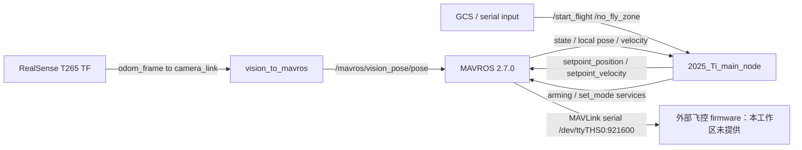

# Architecture and modules

- Generated at: 2026-07-21T00:06:23+08:00
- Workspace: `/home/c/px4_ws`
- Branch: 不适用（多仓库工作区；根目录不是 Git 仓库）
- Commit: 不适用（多仓库工作区；根目录不是 Git 仓库）
- PX4 version: 未验证（PX4-Autopilot firmware 源码缺失）
- Working tree status: 9/19 个源码仓库 dirty；所有仓库 staged=0

## 范围判定

状态：**部分验证**。当前目录是 ROS 2/colcon 伴随计算机工作区，不是 PX4 firmware 源码树。`src/modules/`、`src/lib/`、`src/systemcmds/`、`src/examples/`、`msg/`、`ROMFS/`、`boards/` 和 `platforms/` 均不存在。因此 commander、navigator、EKF、controller、control allocation、sensors、logger、uORB、固件参数系统及其资源释放路径均**未验证**；下文仅描述实际存在的伴随端模块，不能外推为 PX4 固件内部结构。

## 实际模块地图

| 组件 | 角色 | 关键入口/证据 |
|---|---|---|
| `src/mavros/` | ROS 2 与 MAVLink 桥接 | `src/mavros/mavros/package.xml:3-4` 声明 MAVROS 2.7.0 |
| `src/offboard_cpp/` | 自定义 C++ offboard 控制与任务状态机 | `src/offboard_cpp/CMakeLists.txt:39-122`；`src/offboard_cpp/src/offboard_demo.cpp:57`；`src/offboard_cpp/src/2025_Ti_main.cpp:522` |
| `src/offboard_py/` | Python offboard 示例 | `src/offboard_py/setup.py:28-31`；`src/offboard_py/offboard_py/px4_start_demo.py:21-225` |
| `src/px4_bringup/` | 伴随端启动编排与 MAVROS 参数 | `src/px4_bringup/launch/start_all_2025TI.launch.py:7-48`；`src/px4_bringup/config/mavros_params.yaml:1-11` |
| `src/ros2_foxy_vision_to_mavros/` | T265 TF 到 MAVROS vision pose 桥 | `src/ros2_foxy_vision_to_mavros/src/vision_to_mavros.cpp:118-167` |
| `src/serial_driver_ros2/` | 伴随端串口硬件接口 | 存在本地修改，详细硬件审查见 [04](04_hardware_and_drivers.md) |

## 关键数据流

`OffboardControlNode` 以 50 ms wall timer（20 Hz）运行，订阅 `mavros/state`、`mavros/local_position/pose`、`mavros/local_position/velocity_local`，发布 `mavros/setpoint_position/local`、`mavros/setpoint_velocity/cmd_vel`、`px4/mod`，并调用 `mavros/cmd/arming`、`mavros/set_mode`：`src/offboard_cpp/src/lib/offboard_control_node.cpp:13-31`。

`2025_Ti_main` 状态机位于 `src/offboard_cpp/src/2025_Ti_main.cpp:408-518`，顺序为等待禁飞区、等待 GCS、OFFBOARD/arm、起飞、遍历、返航、下降、`AUTO.LAND`。输入 `/no_fly_zone`、`/start_flight` 与输出 `/current_map_id`、`/final_path` 在同文件第 3–20 行建立。

视觉桥在 `VisionToMavros::publishVisionPositionEstimate` 中发布 pose（`src/ros2_foxy_vision_to_mavros/src/vision_to_mavros.cpp:118-167`），launch remap 到 `/mavros/vision_pose/pose`（`launch/t265_tf_to_mavros_launch.py:61-76`）。

## 启动依赖

`src/px4_bringup/launch/start_all_2025TI.launch.py:7-48` 先启动 `px4_fly`，15 秒后启动串口/图像节点，25 秒后启动 `2025_Ti_main_node`。`px4_fly.launch.py:7-54` 立即启动 T265，8 秒后启动视觉桥，12 秒后启动 MAVROS。这是固定延时编排，不是基于 service/topic readiness 的健康门控。

## 自定义与未完成实现

- `src/offboard_cpp/action/Px4Offboard.action:1-15` 已定义并生成接口，但 `src/offboard_cpp/include/lib/offboard_action_node.hpp` 为空，`src/offboard_cpp/src/lib/offboard_action_node.cpp` 仅含 include；`src/offboard_cpp/CMakeLists.txt:64-92` 仍构建空库。
- `src/offboard_cpp/src/new.cpp` 和 `src/offboard_cpp/src/offboard_layered_example.cpp` 未跟踪且未加入 CMake；后者第 1–2 行明确说明 `not wired into CMake`。
- `src/offboard_cpp/CMakeLists.txt:125-134` 的冲突标记已存在于 HEAD，不是未暂存变更；这会阻塞重新配置。
- 视觉 launch 的本地差异将输出频率从 30 Hz 提升至 100 Hz（`src/ros2_foxy_vision_to_mavros/launch/t265_tf_to_mavros_launch.py:37-40`）。

## 已确认的逻辑风险

- `src/offboard_cpp/src/2025_Ti_main.cpp:88-104,123-133,188-191` 只验证禁飞区 ID 数量，不验证 ID/行列范围，随后无边界检查地访问 `grid[r][c]`；畸形输入可越界（P1，静态已验证）。
- `src/offboard_cpp/include/lib/offboard_control_node.hpp:30-47` 与回调 `src/offboard_cpp/src/lib/offboard_control_node.cpp:35-45` 不记录 state/pose/velocity 新鲜度；`reached_target`（第 73–80 行）使用最后缓存值，链路冻结时伴随端无明确 hold/land（P1，静态已验证；固件 failsafe 未验证）。
- Landing 状态每 50 ms 调用 `land()`，没有状态跃迁、节流或响应检查（`2025_Ti_main.cpp:506-508`、`offboard_control_node.cpp:186-190`），会重复堆积异步请求（P2）。
- arm/mode 异步 response 未处理（`offboard_control_node.cpp:106-114,186-190,209-217`），拒绝原因不可观测（P2）。
- `vision_to_mavros.cpp:157-160` 持续追加 `body_path.poses` 而不裁剪；100 Hz 配置会造成长期内存及发布负载增长（P2）。
- TF lookup 失败会在回调中 sleep 1 秒（`vision_to_mavros.cpp:163-166`），可形成整秒 vision 输出空窗（P2）。
- Python 示例在 AUTO.LAND 后仍以 10 Hz 发布缓存下降速度，且日志声称上锁但未 disarm（`px4_start_demo.py:179-214`）（P2）。

完整统一问题格式与修复验证方法见 [风险与技术债务](08_risks_and_technical_debt.md)。
