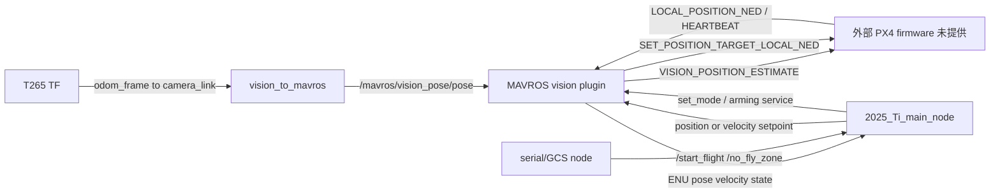

# Communication interfaces

- Generated at: 2026-07-21T00:06:23+08:00
- Workspace: `/home/c/px4_ws`
- Branch: 不适用（多仓库工作区；根目录不是 Git 仓库）
- Commit: 不适用（多仓库工作区；根目录不是 Git 仓库）
- PX4 version: 未验证（PX4-Autopilot firmware 源码缺失）
- Working tree status: 9/19 个源码仓库 dirty；所有仓库 staged=0

## 范围与架构

状态：**部分验证**。工作区未发现 `msg/`、`dds_topics.yaml`、`px4_msgs`、`src/modules/uxrce_dds_client/` 或 uORB 源码；`ros2 pkg prefix px4_msgs` 返回 `Package not found`。所以 firmware uORB、Micro XRCE-DDS、DDS topic/QoS、PX4 ROS 2 原生接口以及固件内部 failsafe 均未验证。

实际已验证链路是 ROS 2 Foxy + MAVROS 2.7.0 + MAVLink 2022.12.30。MAVROS 使用 `src/px4_bringup/config/mavros_params.yaml:1-11` 的 `/dev/ttyTHS0:921600`、MAVLink v2、system/component ID 1，与本工作区之外的飞控通信。

## 关键消息与数据转换

- T265 launch 在 `src/ros2_foxy_vision_to_mavros/launch/t265_tf_to_mavros_launch.py:25-75` 查找 `odom_frame -> camera_link`，并 remap 到 `/mavros/vision_pose/pose`。
- `VisionToMavros::publishVisionPositionEstimate` 位于 `src/ros2_foxy_vision_to_mavros/src/vision_to_mavros.cpp:118-167`。MAVROS vision plugin 在 `src/mavros/mavros_extras/src/plugins/vision_pose_estimate.cpp:127-177` 生成 MAVLink `VISION_POSITION_ESTIMATE`；输入为 `PoseStamped` 时发送全零 covariance。
- MAVLink `LOCAL_POSITION_NED` 经 `src/mavros/mavros/src/plugins/local_position.cpp:138-179` 转为 ROS ENU pose/velocity。
- 控制器 topics/services 建立于 `src/offboard_cpp/src/lib/offboard_control_node.cpp:13-31`；位置/速度 setpoint 发布见第 47–70 行，MAVROS 最终使用 `SET_POSITION_TARGET_LOCAL_NED`（`src/mavros/mavros/include/mavros/setpoint_mixin.hpp:44-85`）。
- `mavros/launch/px4_config.yaml:7-22` 配置 heartbeat timeout 10 s、TIMESYNC 10 Hz；这只证明 MAVROS 默认配置，外部飞控是否加载对应 failsafe 参数未验证。

## Offboard 控制入口

默认 bringup 只启动 `2025_Ti_main_node`（`src/px4_bringup/launch/start_all_2025TI.launch.py:39`）。但 C++ demo、Python demo 与未跟踪 layered example 都能发布同名 setpoint/调用同名服务，代码层没有互斥或 ownership lease。若运维误启多个控制器，可能产生竞争控制入口；运行时未复现。

控制器只检查 `mavros/state.connected`，未记录 state/local pose/local velocity 的接收时间或 freshness（`offboard_control_node.cpp:35-45`；`2025_Ti_main.cpp:374-517`）。视觉桥 TF 中断后停止发布，除初始等待阶段外没有明确的持续健康状态（`vision_to_mavros.cpp:73-105,118-166`）。伴随端没有已验证的 timeout→hold/land 路径；PX4 firmware 侧 estimator/offboard-loss failsafe 因源码和运行参数缺失而未验证。

## 时间与坐标系

- MAVROS 的 NED↔ENU 转换由插件完成；外部 estimator 的具体融合、延迟补偿与 timesync 状态未做运行验证。
- Active launch 设置 `gamma_world=0`、`yaw_cam=0`，但同一 launch 的安装说明对前向安装给出 `gamma=-pi/2`，源码默认又是 `gamma=-pi/2`、`yaw=+pi/2`（`t265_tf_to_mavros_launch.py:10-21,42-59`；`vision_to_mavros.cpp:24-43`）。实际相机安装姿态未验证；错误值会旋转视觉位姿，是 P1 校准风险。

## 自定义接口与兼容性

`src/offboard_cpp/action/Px4Offboard.action:1-15` 由 `CMakeLists.txt:33-36` 生成，但 action 实现为空且不在 active launch。工作区没有自定义 uORB/DDS 消息链。MAVROS 源码/安装版本为 2.7.0，MAVLink release 包为 2022.12.30；PX4 firmware 与 `px4_msgs` 版本均未知，因此线协议方言、消息版本及外部 ROS 2 原生接口兼容性为**未验证**。

## 运行检查与风险

`ros2 topic list` 本次只显示 `/parameter_events` 与 `/rosout`，说明审查时没有运行中的 FCU/MAVROS/传感链；未做串口、UDP、QoS、时钟同步、实际丢包或 failsafe 注入测试。

- P1：视觉坐标安装参数与注释/源码默认不一致，实际硬件姿态未校准验证。
- P1：控制状态无 freshness guard，固件侧超时保护未知。
- P1（操作风险）：多个可执行控制入口无互斥；默认只启动一个，但误启动可竞争。
- P2：固定 8/12/25 秒延时替代 readiness gate。
- P2：PoseStamped 路径发送零 covariance，估计器无法获知视觉质量。
- P1：`src/offboard_cpp/CMakeLists.txt:125-134` 的冲突标记会阻塞通信控制包干净重建。

完整处置与验证标准见 [风险与技术债务](08_risks_and_technical_debt.md) 和 [下一步](09_next_steps.md)。
